Multilevel model of radon levels I
================
Brett Melbourne
14 Oct 2018 (updated 25 Feb 2020)

This script can be rendered to a reproducible report.  
`rmarkdown::render("mlvl01_multilevel_models_1.R")`, or *Ctrl+Shift+K*
in RStudio.  

Reading: Chapter 12 of Gelman & Hill  
See `data/radon_MN_about.txt` for data source  
This is part I: EDA and variance components model (G\&H 12.2).  
We fit a simple variance components model of the average that accounts
for grouping structures (in other language, it is purely a random
effects model and does not have any fixed effects).

Requires packages `rstan` and `rstanarm`. Installation instructions in
[stan01\_install.md](stan01_install.md).

``` r
library(lme4)      #max lik multilevel: lmer(), glmer() etc
library(arm)       #for se.ranef()
library(ggplot2)
library(gridExtra) #arranging multiple plots
library(dplyr)
library(rstan)     #for extract()
library(rstanarm)  #Bayesian multilevel: stan_lmer(), stan_glmer() etc
options(mc.cores = parallel::detectCores())
theme_set(theme_grey()) #rstanarm overrides default ggplot theme: set it back
```

Read in data

``` r
radon_dat <- read.csv("data/radon_MN.csv", as.is=TRUE)
```

### Exploratory data analysis

Here we get to know the dataset, spot any problems or unusual features,
and do some informal graphical modeling by exploring how the data are
structured into groups and focusing on distributions. Thus,
distributional plots like histograms, boxplots, and density plots
feature prominently.

#### Inspect the data

e.g. in each column: what class? what unique values? what range?

``` r
head(radon_dat)
for ( c in 1:ncol(radon_dat) ) {
    print(paste("Column name:",names(radon_dat)[c]))
    print(class(radon_dat[,c]))
    print(unique(radon_dat[,c]))
    print(range(radon_dat[,c]))
}
```

There are 3 points with zero radon recorded. They are all on the first
floor:

``` r
sum(radon_dat$radon == 0)
```

    ## [1] 3

``` r
radon_dat %>%
    filter(radon==0)
```

    ##   floor radon     county
    ## 1 first     0     CARVER
    ## 2 first     0 COTTONWOOD
    ## 3 first     0     MCLEOD

#### Graphical views of the data

Histogram of radon levels

``` r
ggplot(data=radon_dat) +
    geom_histogram(mapping = aes(x=radon),bins=50)
```

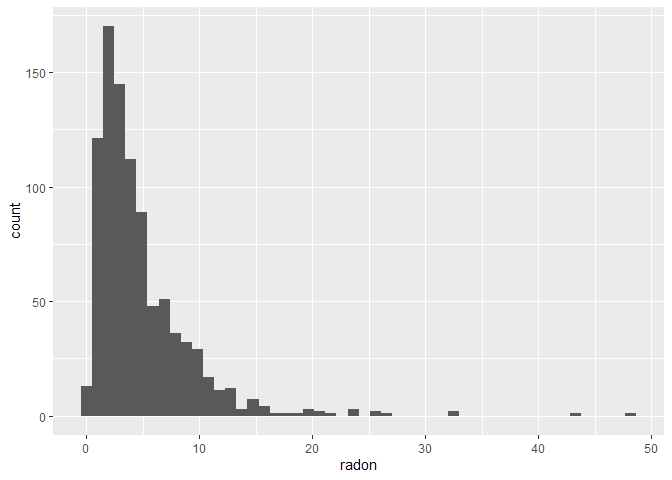<!-- -->

From the histogram we see that radon levels are positive, continuous,
and skewed with a long right tail, so perhaps a lognormal or gamma
distribution or similar will be appropriate for modeling these data.

With ggplot it is easy to group a histogram by floor. We see that there
are far fewer measurements taken on the first floor and that basements
have higher radon levels. Grouped histograms are stacked by default
(position=“stack”). To compare the two groups, we don’t want to stack
them but overlay them, so we want position=“identity”.

``` r
ggplot(data=radon_dat) +
    geom_histogram(mapping = aes(x=radon,fill=floor),position="identity",
                   bins=50,alpha=0.5)
```

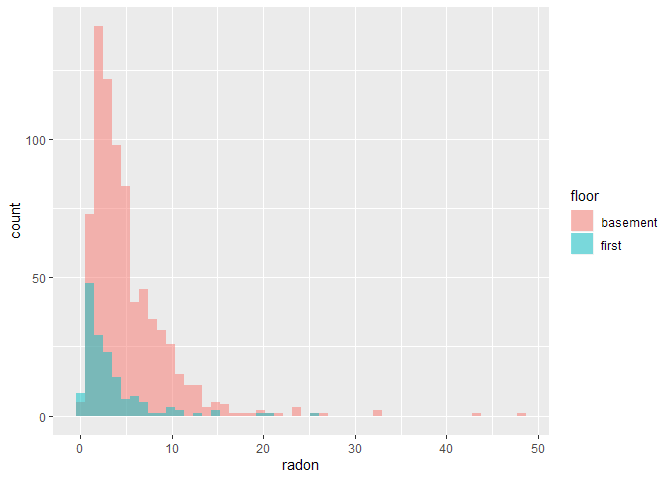<!-- -->

Another way to view this difference between floors is with boxplots. We
see that radon is higher in basements.

``` r
ggplot(data=radon_dat) +
    geom_boxplot(mapping = aes(y=radon, x=floor)) 
```

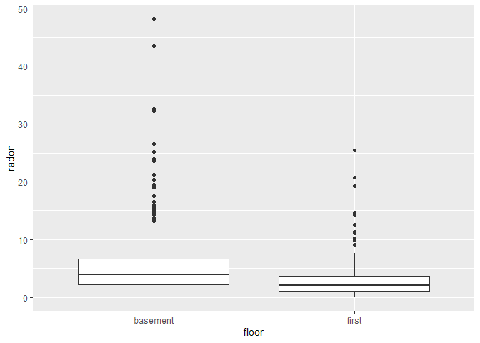<!-- -->

Violin plots combine the information in boxplots and histograms. The
shape is a density smoother. Tufte might complain of too much data ink.
;)

``` r
ggplot(data=radon_dat) +
    geom_violin(mapping = aes(y=radon,x=floor,fill=floor,col=floor))
```

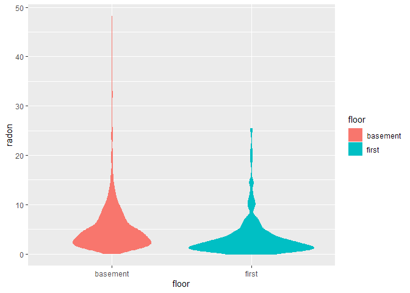<!-- -->

Exploration of structured data is where `ggplot` shines. Let’s look at
radon levels by county and floor. We want to see all the data. To combat
overlap, I have jittered the points on the y-axis (the y-axis does not
measure anything) by appending (using `mutate()`) a new column called
`yjit`, and I’ve added some transparency (`alpha`). This plot was quite
rapid to put together and to try variations and modifications etc. Thus,
we are able to get a sense of all of the features of this dataset
without much coding effort. You may need a large screen or window that
fills your laptop screen. This plot will take a moment to compile.

``` r
radon_dat %>%
    mutate(yjit=jitter(0*radon)) %>%
    ggplot() +
    geom_point(mapping = aes(x=radon,col=floor,y=yjit),shape=1,alpha=0.5) +
    facet_wrap(facets = ~ county) +
    ylim(-0.1,0.1) +
    scale_x_continuous(breaks=c(0,20,40),limits=c(0,50)) +
    theme(axis.text.y=element_blank(),axis.ticks.y=element_blank(),
          axis.title.y=element_blank(),panel.grid=element_blank())
```

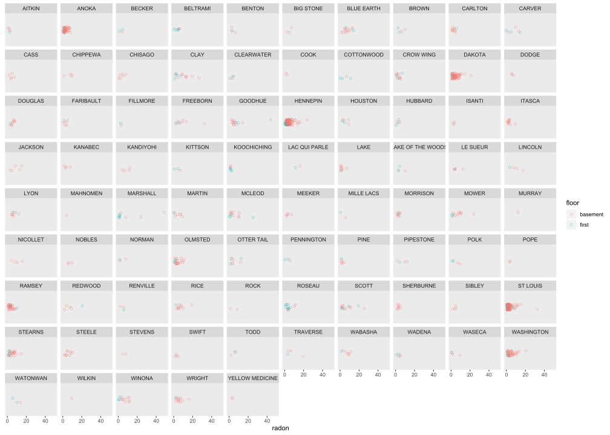<!-- -->

From this plot we can easily see many data features. There aren’t any
points that seem especially like outliers or obvious errors. The data
have probably been well cleaned. Most measurements are in basements.
Some counties have a lot more data. Which counties have the most data?
Calculate sample size in each county and sort by decreasing:

``` r
radon_dat %>%
    group_by(county) %>%
    summarize(sample_size=n()) %>%
    arrange(-sample_size)
```

    ## # A tibble: 85 x 2
    ##    county     sample_size
    ##    <chr>            <int>
    ##  1 ST LOUIS           116
    ##  2 HENNEPIN           105
    ##  3 DAKOTA              63
    ##  4 ANOKA               52
    ##  5 WASHINGTON          46
    ##  6 RAMSEY              32
    ##  7 STEARNS             25
    ##  8 OLMSTED             23
    ##  9 BLUE EARTH          14
    ## 10 CLAY                14
    ## # ... with 75 more rows

We see 5 counties with more than 40 houses sampled. Let’s extract these
(using `filter()`) to get a better sense of how radon distributions
within counties might vary between counties. We’ll also restrict to
basement data.

``` r
lrgst5cty <- radon_dat %>%
    group_by(county) %>%
    filter(n() > 40,floor=="basement")
```

Histograms for these five counties. Anoka and St Louis counties are more
concentrated around low radon levels whereas the other counties have
broader and higher radon levels. So, there appears to be variation among
counties.

``` r
ggplot(data=lrgst5cty) +
    geom_histogram(mapping = aes(x=radon,y=stat(density)),bins=36) +
    facet_wrap(facets = ~ county)
```

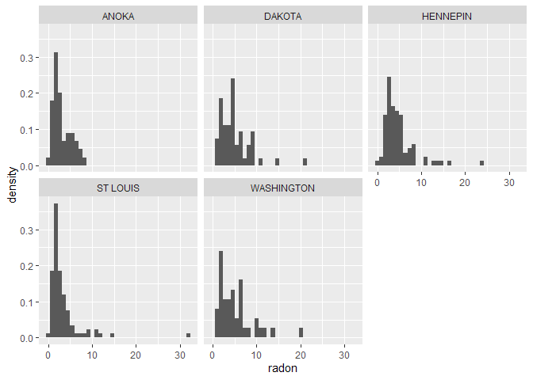<!-- -->

Can we see this with overlapping histograms? Not very well.

``` r
ggplot(data=lrgst5cty) +
    geom_histogram(mapping = aes(x=radon,y=stat(density),fill=county),
                   position="identity",bins=36,alpha=0.6)
```

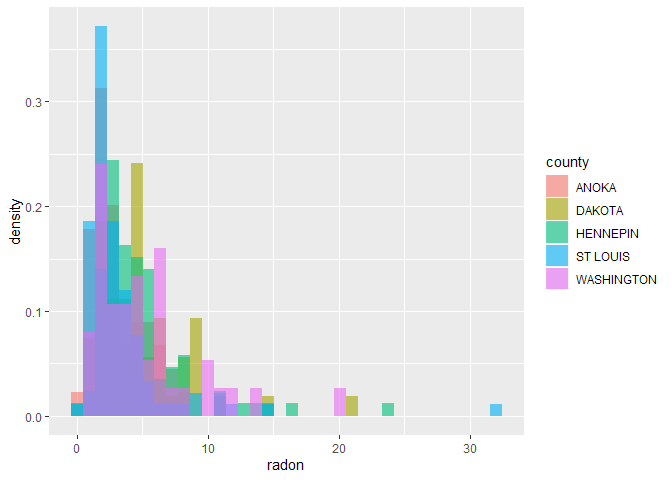<!-- -->

OK so that plot was a dud. No worries, we can try a different view to
show the data more clearly. A density plot is a better view and confirms
our impression from above.

``` r
ggplot(data=lrgst5cty) +
    geom_density(mapping = aes(x=radon,col=county))
```

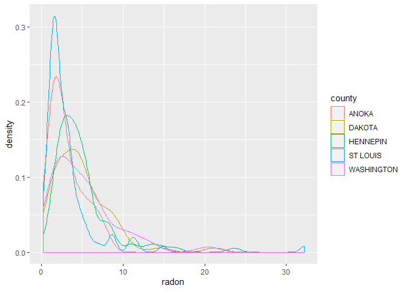<!-- -->

#### Consider lognormal distribution

We are getting close to being ready for model fitting now. I suspect a
lognormal distribution could be useful to model variation. The easiest
way to do that is to simply transform the data (but we could certainly
model a lognormal or gamma directly too). Gelman & Hill log transform,
so we’ll do that too. However, there are zeros in the radon data and we
can’t log those. To deal with this Gelman & Hill add 0.1 to the zeros
only. This makes sense because that is the resolution of the measurement
devices (notice that the radon data are in increments of 0.1).

``` r
radon_dat <- mutate(radon_dat,log_radon=log(ifelse(radon==0,0.1,radon)))
```

Take a look at the transformed data in those five most-sampled counties

First make a data frame with the estimated normal distribution for the
five counties. There is probably a clever way to do this entirely with
`dplyr` using `spread()` but here I’ve done part via a for loop.

Summary statistics for 5 counties

``` r
sm5cty <-
    radon_dat %>%
    group_by(county) %>%
    filter(n() > 40,floor=="basement") %>%
    summarize(mean=mean(log_radon),sd=sd(log_radon),min=min(log_radon),max=max(log_radon))
sm5cty
```

    ## # A tibble: 5 x 5
    ##   county      mean    sd    min   max
    ##   <chr>      <dbl> <dbl>  <dbl> <dbl>
    ## 1 ANOKA      0.903 0.699 -0.916  2.09
    ## 2 DAKOTA     1.35  0.731 -0.693  3.05
    ## 3 HENNEPIN   1.37  0.641 -0.916  3.16
    ## 4 ST LOUIS   0.846 0.776 -1.61   3.47
    ## 5 WASHINGTON 1.37  0.757 -0.223  3.02

Normal distribution fitted to the log-transformed data for 5 counties
(nothing fancy here: the estimated parameters of the distribution are
just the mean and standard deviation of the data) and collected into a
dataframe.

``` r
norm_df <- NULL
for ( i in 1:5 ) {
    x <- seq(sm5cty$min[i],sm5cty$max[i],length.out = 100)
    y <- dnorm(x, sm5cty$mean[i], sm5cty$sd[i])
    norm_df <- rbind(norm_df,data.frame(x,y,county=sm5cty$county[i]))
}
rm(x,y) #clean up
head(norm_df)
```

    ##            x          y county
    ## 1 -0.9162907 0.01927473  ANOKA
    ## 2 -0.8859053 0.02156383  ANOKA
    ## 3 -0.8555199 0.02407924  ANOKA
    ## 4 -0.8251345 0.02683730  ANOKA
    ## 5 -0.7947491 0.02985480  ANOKA
    ## 6 -0.7643637 0.03314887  ANOKA

Now plot the transformed data with density smoother (blue) and fitted
normal (red). The log transformation seems very good:

``` r
radon_dat %>%
    group_by(county) %>%
    filter(n() > 40,floor=="basement") %>%
    ggplot() +
    geom_histogram(mapping = aes(x=log_radon,y=stat(density)),bins=25) +
    geom_density(mapping = aes(x=log_radon),col="blue") +
    geom_line(data=norm_df, mapping = aes(x=x,y=y),col="red") +
    facet_wrap(facets = ~ county)
```

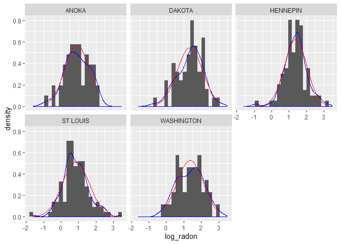<!-- -->

And now for the whole dataset (all counties combined) split by floor.

``` r
sm_byfloor <-
    radon_dat %>%
    group_by(floor) %>%
    summarize(mean=mean(log_radon),sd=sd(log_radon),min=min(log_radon),max=max(log_radon))
```

Normal fitted for 2 floors

``` r
norm_df <- NULL
for ( i in 1:2 ) {
    x <- seq(sm_byfloor$min[i],sm_byfloor$max[i],length.out = 100)
    y <- dnorm(x, sm_byfloor$mean[i], sm_byfloor$sd[i])
    norm_df <- rbind(norm_df,data.frame(x,y,floor=sm_byfloor$floor[i]))
}
rm(x,y)
head(norm_df)
```

    ##           x            y    floor
    ## 1 -2.302585 1.092689e-05 basement
    ## 2 -2.240182 1.576411e-05 basement
    ## 3 -2.177778 2.259861e-05 basement
    ## 4 -2.115375 3.219092e-05 basement
    ## 5 -2.052971 4.556429e-05 basement
    ## 6 -1.990568 6.408482e-05 basement

Now plot the transformed data with density smoother (blue) and fitted
normal (red).

``` r
radon_dat %>%
    group_by(floor) %>%
    ggplot() +
    geom_histogram(mapping = aes(x=log_radon,y=stat(density)),bins=25) +
    geom_density(mapping = aes(x=log_radon),col="blue") +
    geom_line(data=norm_df, mapping = aes(x=x,y=y),col="red") +
    facet_wrap(facets = ~ floor)
```

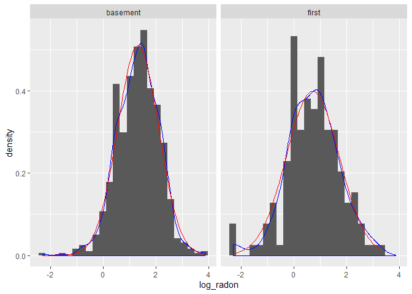<!-- -->

The log transformation seems excellent also for the entire dataset
grouped by floor. You can see a small artifact introduced by adding 0.1
to the zeros (this is the little leftmost spike in the first floor
histogram) but this should not be harmful. Do remember that the
important thing is not that the dependent variable *per se* is Normal,
it is that the **errors**, **or stochasticity**, are Normal. By grouping
the data in the various ways that they are structured by independent
variables and then looking at the distributions we are doing an informal
modeling - i.e. graphically “fitting” floor or county and then examining
the distribution after accounting for the expectation. Here, we have in
essence looked at a main effect of *county* and a main effect of
*floor*, which are the strongest signals to appear in the data from our
graphical exploration.

### G\&H 12.2. Multilevel analysis with no predictors

Our aim here is to look at some models for the mean. We’ll look at three
models:  
1\. Complete pooling - the simplest model for the overall mean  
2\. No pooling - county means, considering counties as fixed effects  
3\. Partial pooling - county means, considering counties as random
effects  
G\&H prefer to not use the terms fixed and random but I use them here
because many of you will know it this way already. See G\&H for more
discussion of this.

We will broadly follow Gelman & Hill’s analysis in Chapter 12 with some
elaborations here and there, and we’ll use `rstanarm` instead of BUGS.

Start by converting county to a factor

``` r
radon_dat <- mutate(radon_dat,county=factor(county))
```

#### Complete pooling

In this case, complete pooling is just the overall mean. That is, we
omit any data structure or grouping variables.

``` r
poolmean <- mean(radon_dat$log_radon)
poolmean
```

    ## [1] 1.224623

``` r
cp_pred_df <- data.frame(poolmean) #df for use with ggplot
```

#### No pooling

You can think of **no pooling** as separately calculating an estimate of
the mean for each county. For example, tabulate the means (and sd and
se) for each county:

``` r
lnrad_mean_var <- 
    radon_dat %>%
    group_by(county) %>%
    summarize(sample_size=n(),cty_mn=mean(log_radon),cty_sd=sd(log_radon)) %>%
    mutate(cty_se=cty_sd/sqrt(sample_size)) %>%
    mutate(sample_size_jit=jitter(sample_size)) #jitter added for plotting
```

Whenever I do a calculation or summary operation I like to look at the
whole result to check that everything makes sense and scan for problems.

``` r
print(lnrad_mean_var,n=Inf) #n=Inf to print all rows
```

    ## # A tibble: 85 x 6
    ##    county            sample_size cty_mn   cty_sd   cty_se sample_size_jit
    ##    <fct>                   <int>  <dbl>    <dbl>    <dbl>           <dbl>
    ##  1 AITKIN                      4  0.660   0.459    0.230            3.82 
    ##  2 ANOKA                      52  0.833   0.770    0.107           52.0  
    ##  3 BECKER                      3  1.05    0.750    0.433            3.08 
    ##  4 BELTRAMI                    7  1.14    0.968    0.366            7.19 
    ##  5 BENTON                      4  1.25    0.424    0.212            4.06 
    ##  6 BIG STONE                   3  1.51    0.516    0.298            2.98 
    ##  7 BLUE EARTH                 14  1.91    0.553    0.148           14.0  
    ##  8 BROWN                       4  1.63    0.608    0.304            4.07 
    ##  9 CARLTON                    10  0.931   0.615    0.194            9.86 
    ## 10 CARVER                      6  1.20    1.90     0.777            6.10 
    ## 11 CASS                        5  1.40    0.504    0.225            4.93 
    ## 12 CHIPPEWA                    4  1.73    0.936    0.468            4.05 
    ## 13 CHISAGO                     6  1.04    0.845    0.345            5.85 
    ## 14 CLAY                       14  1.78    1.01     0.270           14.0  
    ## 15 CLEARWATER                  4  0.978   0.740    0.370            3.89 
    ## 16 COOK                        2  0.665   0.464    0.328            2.08 
    ## 17 COTTONWOOD                  4  0.734   2.12     1.06             3.87 
    ## 18 CROW WING                  12  0.941   0.669    0.193           12.0  
    ## 19 DAKOTA                     63  1.29    0.752    0.0948          63.1  
    ## 20 DODGE                       3  1.80    0.153    0.0883           2.90 
    ## 21 DOUGLAS                     9  1.65    0.351    0.117            9.06 
    ## 22 FARIBAULT                   6  0.517   1.47     0.598            6.16 
    ## 23 FILLMORE                    2  1.04    0.175    0.123            2.20 
    ## 24 FREEBORN                    9  1.94    0.807    0.269            8.95 
    ## 25 GOODHUE                    14  1.85    0.711    0.190           14.0  
    ## 26 HENNEPIN                  105  1.29    0.710    0.0693         105.   
    ## 27 HOUSTON                     6  1.53    0.552    0.225            6.14 
    ## 28 HUBBARD                     5  0.809   0.714    0.319            5.10 
    ## 29 ISANTI                      3  1.06    0.249    0.144            3.10 
    ## 30 ITASCA                     11  0.926   0.584    0.176           11.2  
    ## 31 JACKSON                     5  2.02    0.689    0.308            5.07 
    ## 32 KANABEC                     4  1.24    0.632    0.316            3.87 
    ## 33 KANDIYOHI                   4  2.06    0.510    0.255            3.85 
    ## 34 KITTSON                     3  1.11    1.07     0.620            2.99 
    ## 35 KOOCHICHING                 7  0.407   0.375    0.142            6.86 
    ## 36 LAC QUI PARLE               2  2.60    0.246    0.174            2.14 
    ## 37 LAKE                        9  0.322   0.826    0.275            8.94 
    ## 38 LAKE OF THE WOODS           4  1.51    0.561    0.281            4.13 
    ## 39 LE SUEUR                    5  1.60    0.528    0.236            4.82 
    ## 40 LINCOLN                     4  2.14    0.674    0.337            3.97 
    ## 41 LYON                        8  1.88    0.323    0.114            7.82 
    ## 42 MAHNOMEN                    1  1.36  NaN      NaN                0.941
    ## 43 MARSHALL                    9  1.20    1.50     0.499            9.02 
    ## 44 MARTIN                      7  0.938   1.26     0.477            7.00 
    ## 45 MCLEOD                     13  1.07    1.40     0.388           13.2  
    ## 46 MEEKER                      5  1.21    0.492    0.220            4.84 
    ## 47 MILLE LACS                  2  0.524   1.72     1.22             1.99 
    ## 48 MORRISON                    9  1.07    0.389    0.130            8.97 
    ## 49 MOWER                      13  1.59    0.940    0.261           12.9  
    ## 50 MURRAY                      1  2.49  NaN      NaN                1.01 
    ## 51 NICOLLET                    4  2.17    0.557    0.278            4.06 
    ## 52 NOBLES                      3  1.93    0.306    0.177            2.99 
    ## 53 NORMAN                      3  1.01    0.936    0.541            2.87 
    ## 54 OLMSTED                    23  1.21    0.761    0.159           23.0  
    ## 55 OTTER TAIL                  8  1.35    0.828    0.293            7.95 
    ## 56 PENNINGTON                  3  0.621   1.60     0.922            3.07 
    ## 57 PINE                        6  0.642   0.494    0.202            5.95 
    ## 58 PIPESTONE                   4  1.68    0.884    0.442            3.93 
    ## 59 POLK                        4  1.36    0.891    0.446            4.09 
    ## 60 POPE                        2  1.28    0.0786   0.0556           2.04 
    ## 61 RAMSEY                     32  1.09    0.668    0.118           31.9  
    ## 62 REDWOOD                     5  1.84    0.902    0.403            5.06 
    ## 63 RENVILLE                    3  1.43    0.597    0.344            2.96 
    ## 64 RICE                       11  1.78    0.565    0.170           11.0  
    ## 65 ROCK                        2  1.30    1.17     0.829            2.19 
    ## 66 ROSEAU                     14  1.25    0.681    0.182           14.1  
    ## 67 SCOTT                      13  1.58    0.972    0.270           13.1  
    ## 68 SHERBURNE                   8  1.09    0.376    0.133            8.03 
    ## 69 SIBLEY                      4  1.24    0.566    0.283            4.15 
    ## 70 ST LOUIS                  116  0.768   0.800    0.0743         116.   
    ## 71 STEARNS                    25  1.38    0.702    0.140           25.1  
    ## 72 STEELE                     10  1.58    0.599    0.189            9.98 
    ## 73 STEVENS                     2  1.79    0.407    0.288            1.85 
    ## 74 SWIFT                       4  0.987   0.484    0.242            3.90 
    ## 75 TODD                        3  1.48    0.645    0.373            2.87 
    ## 76 TRAVERSE                    4  1.83    0.830    0.415            3.82 
    ## 77 WABASHA                     7  1.72    0.837    0.316            6.82 
    ## 78 WADENA                      5  0.997   0.790    0.353            4.84 
    ## 79 WASECA                      4  0.435   1.34     0.668            4.17 
    ## 80 WASHINGTON                 46  1.25    0.797    0.117           46.1  
    ## 81 WATONWAN                    3  2.23    0.449    0.259            3.18 
    ## 82 WILKIN                      1  2.23  NaN      NaN                1.04 
    ## 83 WINONA                     13  1.46    1.04     0.289           12.9  
    ## 84 WRIGHT                     13  1.59    0.599    0.166           13.1  
    ## 85 YELLOW MEDICINE             2  1.19    0.172    0.122            1.85

We see there are three counties with only one sample, so we were not
able to calculate a standard deviation for those. We could fix this (by
estimating from sample size and sd from the other counties) but let’s
not worry at this stage. Plot what we’ve got:

``` r
ggplot(data=lnrad_mean_var) +
    geom_hline(mapping=aes(yintercept=poolmean),data=cp_pred_df,col="blue") +
    geom_point(mapping=aes(x=sample_size_jit,y=cty_mn)) +
    geom_linerange(mapping=aes(x=sample_size_jit,ymin=cty_mn-cty_se,ymax=cty_mn+cty_se)) +
    scale_x_continuous(trans="log",breaks=c(1,3,10,30,100)) +
    labs(x="Sample size in county j",y="mean ln(radon) in county j",
         title="No pooling: separate analyses by county")
```

    ## Warning: Removed 3 rows containing missing values (geom_linerange).

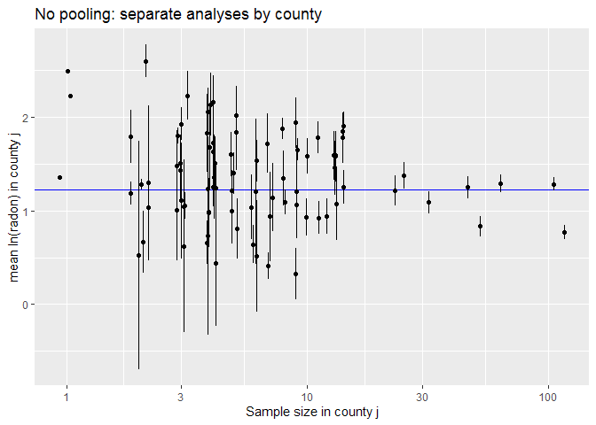<!-- -->

This plot is very similar to G\&H Fig. 12.1a but not the same. The blue
line is the completely pooled estimate (the overall mean). Some of the
standard errors are larger than G\&H 12.1a because we have calculated
them independently for each county. The three points to the left without
an interval are the ones we couldn’t calculate a se for.

Now we’ll do as G\&H did in Ch 12. This is also a **no pooling**
analysis for the county means. This analysis does not pool information
about the **means** but it does pool information about the
**uncertainty** (the error of each observation contributes to an
estimate of the mean residual error). This is sometimes called the
**fixed effects model**, where here `county` is the fixed effect. To fit
this model in a frequentist paradigm we can use `lm()`, which is
implicitly a GLM with Normal distribution and identity link. We fit
`county` as a categorical variable, which gives us estimated means for
each county where the maximum likelihood estimate is just the mean of
the within-county samples. We use the means parameterization (i.e
without the intercept, thus “-1”):

``` r
npfit <- lm( log_radon ~ -1 + county, data=radon_dat )
```

Check the fitted model (diagnostic plots)

``` r
plot(npfit,1:5,ask=FALSE)
```

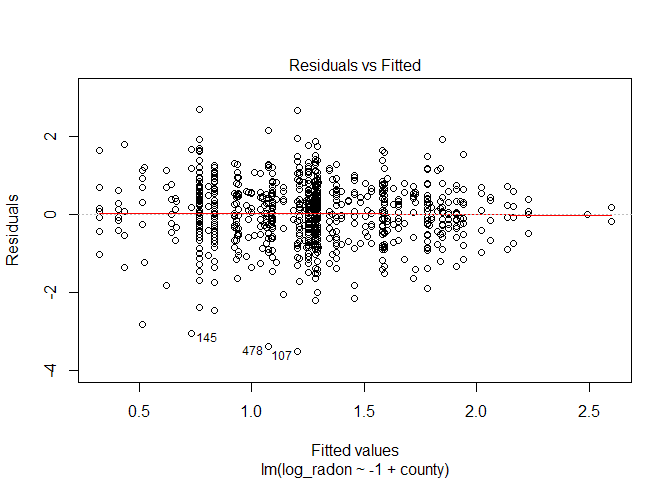<!-- -->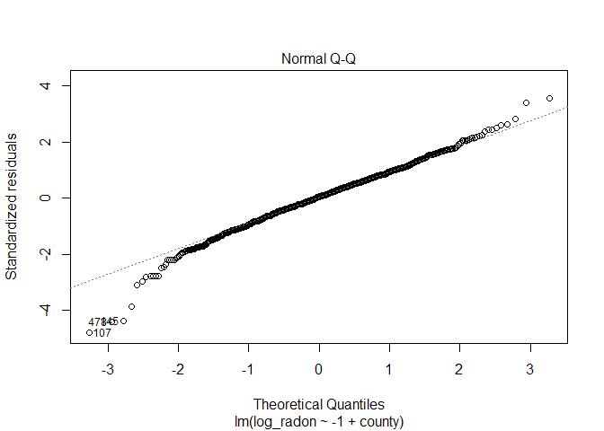<!-- --><!-- -->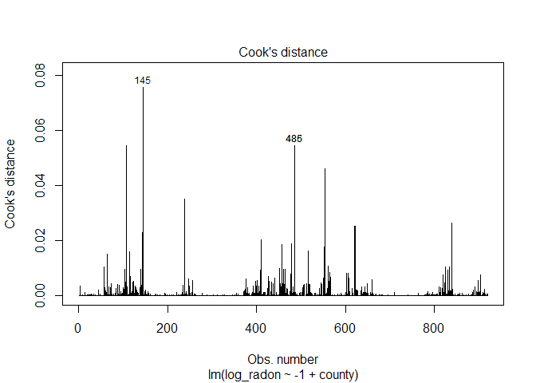<!-- -->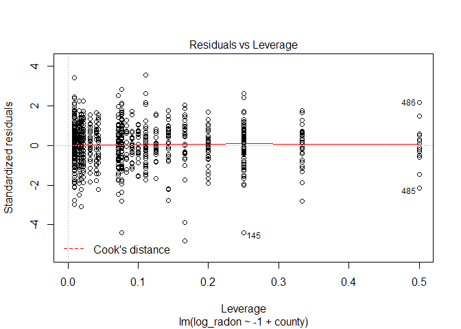<!-- -->

The extended left tail, including the 0 + 0.1 hack, is evident in the QQ
plot (that’s where it peels off the line at the left hand side) but
otherwise the diagnostics look good. Let’s also look at a residuals
histogram compared to the Normal distribution:

``` r
r <- residuals(npfit)
x <- seq(min(r),max(r),length.out=100)
y <- dnorm(x,mean(r),sd(r))
res_df <- data.frame(residuals=r)
norm_df <- data.frame(x=x,y=y)
rm(r,x,y)
ggplot() +
    geom_histogram(mapping=aes(x=residuals,y=stat(density)),data=res_df,bins=60) +
    geom_line(mapping=aes(x=x,y=y),col="red",data=norm_df)
```

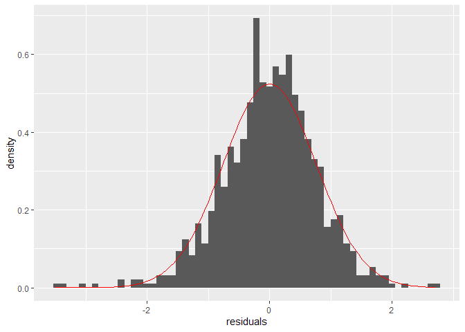<!-- -->

So, Normal looks like a good approximation for the errors.

Plot the fitted model.

``` r
np_pred_df <- data.frame(coef(summary(npfit))[,1:2],lnrad_mean_var$sample_size_jit)
names(np_pred_df) <- c("cty_mn","cty_se","sample_size_jit")
gh12.1a <- 
    ggplot(data=np_pred_df) +
    geom_hline(mapping=aes(yintercept=poolmean),data=cp_pred_df,col="blue") +
    geom_point(mapping=aes(x=sample_size_jit,y=cty_mn)) +
    geom_linerange(mapping=aes(x=sample_size_jit,ymin=cty_mn-cty_se,ymax=cty_mn+cty_se)) +
    scale_x_continuous(trans="log",breaks=c(1,3,10,30,100)) +
    ylim(-0.1,3.3) +
    labs(x="Sample size in county j",y="mean ln(radon) in county j",
         title="No pooling: estimates from linear model fit")
gh12.1a
```

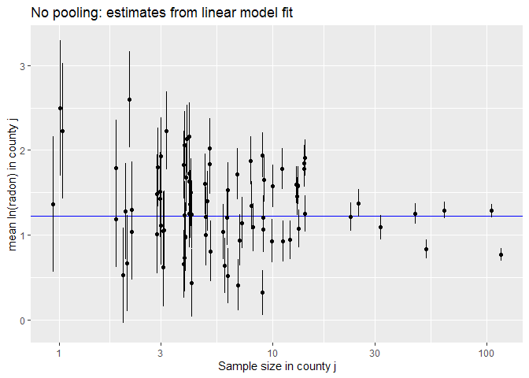<!-- -->

Apart from some unimportant details, this is the same as G\&H Fig.
12.1a. The blue line is the complete pooling model (i.e. the overall
mean).

#### Partial pooling & shrinkage in multilevel model

In the **complete pooling** model (i.e. the overall mean) we did not
include variation among counties, while in the **no pooling** model, we
estimated the county means separately, whether literally by separate
analyses or in the fixed effects model. In the **partial pooling** model
the estimates for the mean in each county are a balance between the
information in a county sample and information from other counties. To
achieve this, we formulate a **multilevel model**. In the multilevel
model we consider two levels for means: an overall mean and means for
counties. Each of the two levels of these means has an associated
stochastic process so that there are two variance components, a
between-county variance associated with the overall mean and a
within-county variance associated with the county means. To fit this
model in a frequentist paradigm we can use `lmer()` from the package
`lme4`. This model is implicitly a generalized linear mixed model (GLMM)
with Normal distribution, identity link, and two levels of
stochasticity:

``` r
ppfit <- lmer( log_radon ~ 1 + (1|county), REML=FALSE, data=radon_dat )
```

The `1` part of the above model specifies the overall mean (the
intercept term) while the `+ (1|county)` part specifies that the
intercepts for each county should be random variables (more specifically
the deviations, or “random effects”, of county means from the overall
mean will be modeled as a Normally distributed random variable).
`REML=FALSE` says to fit by ordinary maximum likelihood rather than the
default residual maximum likelihood.

By default, we get limited diagnostics for `lmer()`. Just residuals vs
fitted. The residual plot looks good though.

``` r
plot(ppfit)
```

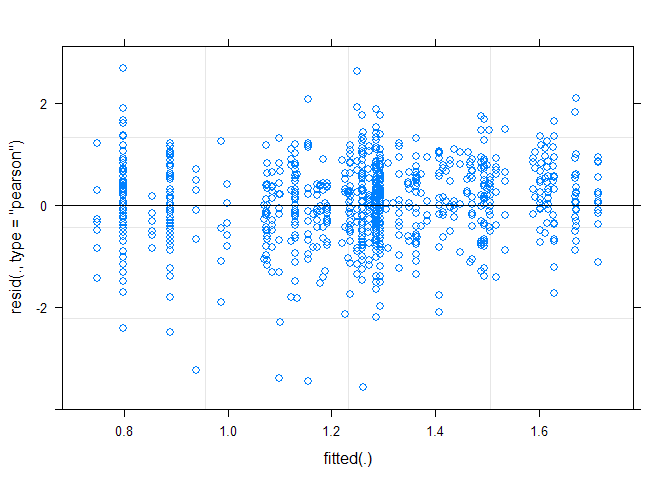<!-- -->

In the summary we now see estimates for two levels (or strata) of
variance, county (among counties) and residual (among houses within
counties):

``` r
summary(ppfit)
```

    ## Linear mixed model fit by maximum likelihood  ['lmerMod']
    ## Formula: log_radon ~ 1 + (1 | county)
    ##    Data: radon_dat
    ## 
    ##      AIC      BIC   logLik deviance df.resid 
    ##   2261.2   2275.7  -1127.6   2255.2      916 
    ## 
    ## Scaled residuals: 
    ##     Min      1Q  Median      3Q     Max 
    ## -4.4668 -0.5757  0.0432  0.6460  3.3508 
    ## 
    ## Random effects:
    ##  Groups   Name        Variance Std.Dev.
    ##  county   (Intercept) 0.0934   0.3056  
    ##  Residual             0.6366   0.7979  
    ## Number of obs: 919, groups:  county, 85
    ## 
    ## Fixed effects:
    ##             Estimate Std. Error t value
    ## (Intercept)  1.31226    0.04857   27.02

The random effects table shows that the variance at the houses-within
county level, the residual variance (0.6), is about 6 times greater than
the variance at the between-county level (0.09). In other words, most of
the variance in radon is at a small spatial scale, i.e. between houses.
Keep in mind that the house-level variance includes radon measurement
error in addition to natural variability among houses.

Plot the fitted model

``` r
pp_pred_df <- data.frame(coef(ppfit)$county,se.ranef(ppfit)$county[,1],lnrad_mean_var$sample_size_jit)
names(pp_pred_df) <- c("cty_mn","cty_se","sample_size_jit")
pp_mean_df <- data.frame(ovrl_mn=summary(ppfit)$coefficients[1],ovrl_se=summary(ppfit)$coefficients[2])
gh12.1b <- 
    ggplot(data=pp_pred_df) +
    geom_hline(mapping=aes(yintercept=poolmean),data=cp_pred_df,col="blue") +
    geom_hline(mapping=aes(yintercept=ovrl_mn),data=pp_mean_df,col="blue",lty=2) +
    geom_point(mapping=aes(x=sample_size_jit,y=cty_mn)) +
    geom_linerange(mapping=aes(x=sample_size_jit,ymin=cty_mn-cty_se,ymax=cty_mn+cty_se)) +
    scale_x_continuous(trans="log",breaks=c(1,3,10,30,100)) +
    ylim(-0.1,3.3) +
    labs(x="Sample size in county j",y="mean ln(radon) in county j",
         title="Partial pooling: multilevel model, max likelihood")
```

Add a reference point to no pooling and partial pooling plots to
illustrate shrinkage:

``` r
gh12.1a_ref <- gh12.1a + 
    geom_point(mapping=aes(x=sample_size_jit,y=cty_mn),data=np_pred_df[36,],pch=1,cex=10,col="red")
gh12.1b_ref <- gh12.1b + 
    geom_point(mapping=aes(x=sample_size_jit,y=cty_mn),data=pp_pred_df[36,],pch=1,cex=10,col="red")
```

Plot side by side

``` r
grid.arrange(gh12.1a_ref, gh12.1b_ref, nrow = 1) 
```

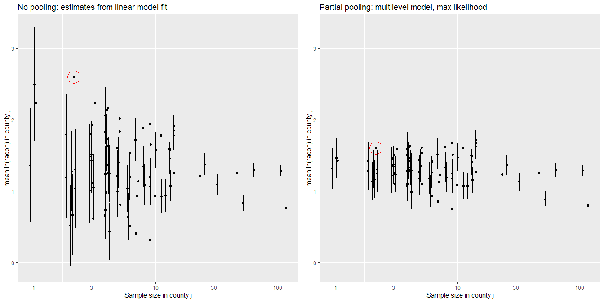<!-- -->

The right panel is the fitted multilevel model compared to our previous
fit of the no pooling model in the left panel. In the multilevel model
the estimates for the mean in each county are a balance between the
sample mean and the overall mean, depending on the within-county sample
size. That is, the information in a particular county is pooled with the
information from other counties. You can see how this works by comparing
the multilevel (partial pooling) model in the right panel to the no
pooling model in the left panel. If there are more observations for a
given county, there is more information at the county level, so the
estimate of the county mean in the multilevel model remains close to the
sample mean for the county. If there are fewer observations, information
from the other counties will pull an estimate for a particular county
toward the overall mean, like county 36, which is circled in red. This
is called **shrinkage**. The estimate shrinks toward the overall mean.
The other thing to note is the dashed blue line. This is the estimated
overall mean from the multilevel model, which is also a balance of the
information at different levels. You can see that it is higher than the
simpler (but naive) overall mean of the data (solid blue line).

#### Partial pooling, Bayesian fit of multilevel model

Figure 12.1b in G\&H was actually from a Bayesian version of the
multilevel model fitted using BUGS. Compared to the maximum likelihood
model we just fitted, this model had flat priors for the three model
parameters (overall mean and the two variances). The Bayesian version of
this model is accomplished easily with the `stan_lmer()` function of
`rstanarm`. We will use the weakly informative priors of `stan_lmer()`
by default rather than the flat priors in the BUGS fit of G\&H. The
difference in analyses is neglible as the data overwhelm the priors in
this case.

``` r
ppfit_bayes <- stan_lmer( log_radon ~ 1 + (1|county), data=radon_dat )
print(summary(ppfit_bayes)[,c("mean","sd","n_eff","Rhat")],digits=3)
```

    ##                                              mean     sd n_eff  Rhat
    ## (Intercept)                              1.31e+00 0.0499  1523 1.002
    ## b[(Intercept) county:AITKIN]            -2.45e-01 0.2442  4827 1.001
    ## b[(Intercept) county:ANOKA]             -4.23e-01 0.1141  3544 1.000
    ## b[(Intercept) county:BECKER]            -8.26e-02 0.2636  6215 1.000
    ## b[(Intercept) county:BELTRAMI]          -8.92e-02 0.2162  5200 1.001
    ## b[(Intercept) county:BENTON]            -2.02e-02 0.2476  5679 0.999
    ## b[(Intercept) county:BIG_STONE]          5.82e-02 0.2648  5510 0.999
    ## b[(Intercept) county:BLUE_EARTH]         4.02e-01 0.1844  4258 1.000
    ## b[(Intercept) county:BROWN]              1.21e-01 0.2391  5727 0.999
    ## b[(Intercept) county:CARLTON]           -2.25e-01 0.1990  5196 0.999
    ## b[(Intercept) county:CARVER]            -4.95e-02 0.2256  5453 1.000
    ## b[(Intercept) county:CASS]               4.51e-02 0.2349  5984 1.000
    ## b[(Intercept) county:CHIPPEWA]           1.62e-01 0.2448  4868 0.999
    ## b[(Intercept) county:CHISAGO]           -1.27e-01 0.2242  5069 1.000
    ## b[(Intercept) county:CLAY]               3.17e-01 0.1771  4583 1.000
    ## b[(Intercept) county:CLEARWATER]        -1.28e-01 0.2528  6025 1.000
    ## b[(Intercept) county:COOK]              -1.56e-01 0.2754  5318 1.000
    ## b[(Intercept) county:COTTONWOOD]        -2.19e-01 0.2502  4518 1.000
    ## b[(Intercept) county:CROW_WING]         -2.38e-01 0.1851  4756 1.000
    ## b[(Intercept) county:DAKOTA]            -1.91e-02 0.1058  3811 1.000
    ## b[(Intercept) county:DODGE]              1.51e-01 0.2705  5341 1.000
    ## b[(Intercept) county:DOUGLAS]            1.96e-01 0.2046  4362 0.999
    ## b[(Intercept) county:FARIBAULT]         -3.77e-01 0.2244  4107 1.000
    ## b[(Intercept) county:FILLMORE]          -6.60e-02 0.2741  5413 1.000
    ## b[(Intercept) county:FREEBORN]           3.57e-01 0.2029  4332 1.001
    ## b[(Intercept) county:GOODHUE]            3.62e-01 0.1835  5823 1.000
    ## b[(Intercept) county:HENNEPIN]          -2.66e-02 0.0898  2671 1.000
    ## b[(Intercept) county:HOUSTON]            1.01e-01 0.2253  5304 0.999
    ## b[(Intercept) county:HUBBARD]           -2.17e-01 0.2401  5121 1.000
    ## b[(Intercept) county:ISANTI]            -8.32e-02 0.2609  5034 0.999
    ## b[(Intercept) county:ITASCA]            -2.44e-01 0.1961  6192 0.999
    ## b[(Intercept) county:JACKSON]            3.02e-01 0.2370  4827 0.999
    ## b[(Intercept) county:KANABEC]           -3.29e-02 0.2385  5269 1.000
    ## b[(Intercept) county:KANDIYOHI]          2.78e-01 0.2499  3732 0.999
    ## b[(Intercept) county:KITTSON]           -6.33e-02 0.2568  4871 1.000
    ## b[(Intercept) county:KOOCHICHING]       -4.66e-01 0.2253  4348 0.999
    ## b[(Intercept) county:LAC_QUI_PARLE]      3.03e-01 0.2880  3872 1.000
    ## b[(Intercept) county:LAKE]              -5.64e-01 0.2113  4066 0.999
    ## b[(Intercept) county:LAKE_OF_THE_WOODS]  7.57e-02 0.2354  5932 0.999
    ## b[(Intercept) county:LE_SUEUR]           1.26e-01 0.2364  6638 1.001
    ## b[(Intercept) county:LINCOLN]            3.08e-01 0.2512  4487 0.999
    ## b[(Intercept) county:LYON]               3.04e-01 0.2166  4740 1.000
    ## b[(Intercept) county:MAHNOMEN]           3.39e-03 0.2905  7109 0.999
    ## b[(Intercept) county:MARSHALL]          -6.35e-02 0.1976  4888 1.000
    ## b[(Intercept) county:MARTIN]            -1.94e-01 0.2207  5510 1.000
    ## b[(Intercept) county:MCLEOD]            -1.59e-01 0.1888  4893 1.000
    ## b[(Intercept) county:MEEKER]            -3.66e-02 0.2352  5312 1.000
    ## b[(Intercept) county:MILLE_LACS]        -1.87e-01 0.2814  5253 0.999
    ## b[(Intercept) county:MORRISON]          -1.40e-01 0.2066  4961 1.000
    ## b[(Intercept) county:MOWER]              1.84e-01 0.1846  4833 1.000
    ## b[(Intercept) county:MURRAY]             1.66e-01 0.3005  4133 1.000
    ## b[(Intercept) county:NICOLLET]           3.27e-01 0.2508  4328 0.999
    ## b[(Intercept) county:NOBLES]             1.89e-01 0.2594  4476 1.000
    ## b[(Intercept) county:NORMAN]            -9.41e-02 0.2661  5185 0.999
    ## b[(Intercept) county:OLMSTED]           -7.58e-02 0.1543  4437 1.000
    ## b[(Intercept) county:OTTER_TAIL]         2.01e-02 0.2130  5623 1.000
    ## b[(Intercept) county:PENNINGTON]        -2.14e-01 0.2616  5841 0.999
    ## b[(Intercept) county:PINE]              -3.19e-01 0.2330  4317 1.000
    ## b[(Intercept) county:PIPESTONE]          1.40e-01 0.2444  4762 1.001
    ## b[(Intercept) county:POLK]               2.15e-02 0.2436  5294 1.000
    ## b[(Intercept) county:POPE]              -6.84e-03 0.2790  5306 0.999
    ## b[(Intercept) county:RAMSEY]            -1.84e-01 0.1351  3988 1.000
    ## b[(Intercept) county:REDWOOD]            2.25e-01 0.2385  4411 1.000
    ## b[(Intercept) county:RENVILLE]           4.26e-02 0.2476  4718 1.000
    ## b[(Intercept) county:RICE]               2.92e-01 0.1942  5532 1.000
    ## b[(Intercept) county:ROCK]               4.29e-03 0.2748  5530 1.000
    ## b[(Intercept) county:ROSEAU]            -3.68e-02 0.1758  5294 1.000
    ## b[(Intercept) county:SCOTT]              1.74e-01 0.1826  5065 1.000
    ## b[(Intercept) county:SHERBURNE]         -1.22e-01 0.2094  5831 0.999
    ## b[(Intercept) county:SIBLEY]            -2.32e-02 0.2465  6113 0.999
    ## b[(Intercept) county:ST_LOUIS]          -5.11e-01 0.0873  2983 1.000
    ## b[(Intercept) county:STEARNS]            4.75e-02 0.1457  3920 0.999
    ## b[(Intercept) county:STEELE]             1.61e-01 0.1978  4732 1.000
    ## b[(Intercept) county:STEVENS]            1.15e-01 0.2723  5339 1.000
    ## b[(Intercept) county:SWIFT]             -1.27e-01 0.2454  5522 1.000
    ## b[(Intercept) county:TODD]               5.41e-02 0.2591  5601 0.999
    ## b[(Intercept) county:TRAVERSE]           1.97e-01 0.2513  4707 0.999
    ## b[(Intercept) county:WABASHA]            2.12e-01 0.2154  5645 0.999
    ## b[(Intercept) county:WADENA]            -1.34e-01 0.2338  5414 1.000
    ## b[(Intercept) county:WASECA]            -3.28e-01 0.2513  4596 1.000
    ## b[(Intercept) county:WASHINGTON]        -5.18e-02 0.1157  3614 1.000
    ## b[(Intercept) county:WATONWAN]           2.88e-01 0.2678  3654 1.000
    ## b[(Intercept) county:WILKIN]             1.29e-01 0.2872  5011 1.000
    ## b[(Intercept) county:WINONA]             9.55e-02 0.1781  6230 1.000
    ## b[(Intercept) county:WRIGHT]             1.86e-01 0.1860  5150 0.999
    ## b[(Intercept) county:YELLOW_MEDICINE]   -2.47e-02 0.2701  5710 1.000
    ## sigma                                    7.99e-01 0.0197  4446 0.999
    ## Sigma[county:(Intercept),(Intercept)]    1.00e-01 0.0312  1125 1.000
    ## mean_PPD                                 1.22e+00 0.0367  4630 1.000
    ## log-posterior                           -1.22e+03 9.4571   845 1.002

Diagnostics: inspect convergence, histograms for posteriors etc

``` r
launch_shinystan(ppfit_bayes)
```

Extract posterior samples

``` r
samples <- extract(ppfit_bayes$stanfit)
names(samples)
```

    ## [1] "alpha"    "b"        "aux"      "theta_L"  "mean_PPD" "lp__"

``` r
str(samples$alpha) #Samples of overall mean. Matrix: samples by row, 1 col
```

    ##  num [1:4000, 1] 1.29 1.25 1.34 1.34 1.35 ...
    ##  - attr(*, "dimnames")=List of 2
    ##   ..$ iterations: NULL
    ##   ..$           : NULL

``` r
str(samples$b) #Samples of county deviations. Matrix: samples by row, 86 cols
```

    ##  num [1:4000, 1:86] -0.5347 -0.1413 -0.1824 -0.1086 -0.0513 ...
    ##  - attr(*, "dimnames")=List of 2
    ##   ..$ iterations: NULL
    ##   ..$           : NULL

I’m not sure what the 86th b parameter is (hmm, weird) but the first 85
are the county samples.

Algorithm for posterior samples of the county means. This is an example
where we want to get the posterior distribution for a **derived
quantity** - the county means. We merely need to add the samples for the
overall mean (`alpha`) to the samples for the county deviations (`b`).

``` r
countysamples <- samples$b[,1:85] * NA
for ( i in 1:85 ) {
    countysamples[,i] <- samples$b[,i] + samples$alpha
}
# Now calculate mean and standard deviation of the posterior distributions for
# the county means.
countypostmns <- rep(NA,85)
countypostses <- rep(NA,85)
for ( i in 1:85 ) {
    countypostmns[i] <- mean(countysamples[,i])
    countypostses[i] <- sd(countysamples[,i])
}
```

Plot of posterior means and standard deviations

``` r
ppbayes_pred_df <- data.frame(countypostmns,countypostses,lnrad_mean_var$sample_size_jit)
names(ppbayes_pred_df) <- c("cty_mn","cty_se","sample_size_jit")
ppbayes_mean_df <- data.frame(ovrl_mn=mean(samples$alpha),ovrl_se=sd(samples$alpha))
gh12.1b_bayes <-
    ggplot(data=ppbayes_pred_df) +
    geom_hline(mapping=aes(yintercept=ovrl_mn),data=ppbayes_mean_df,col="blue",lty=2) +
    geom_point(mapping=aes(x=sample_size_jit,y=cty_mn)) +
    geom_linerange(mapping=aes(x=sample_size_jit,ymin=cty_mn-cty_se,ymax=cty_mn+cty_se)) +
    scale_x_continuous(trans="log",breaks=c(1,3,10,30,100)) +
    ylim(-0.1,3.3) +
    labs(x="Sample size in county j",y="mean ln(radon) in county j",
         title="Partial pooling: multilevel model, Bayesian")
grid.arrange(gh12.1b, gh12.1b_bayes, nrow = 1)
```

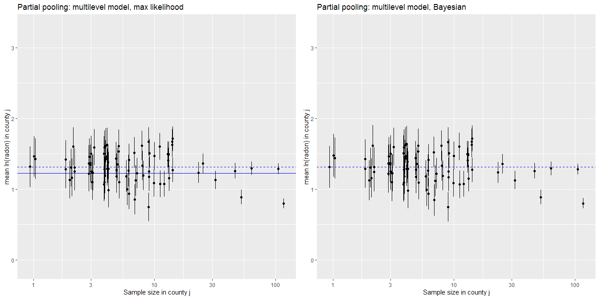<!-- -->

The maximum likelihood and Bayesian model estimates are practically
identical. This is not surprising, since the priors in the Bayesian
model were weak and thus most of the information is in the likelihood.
