Multilevel model of radon levels II
================
Brett Melbourne
28 Oct 2018 (updated 27 Feb 2020)

Chapter 12 of Gelman & Hill  
See `data/radon_MN_about.txt` for data source  

This is part II. In part I, we did EDA and considered a variance
components model for homes within counties, introducing the concept of
partial pooling and shrinkage (G\&H 12.2). Here, we will consider a
house-level (G\&H 12.3-4) predictor of radon. In part III, we will
consider a county-level predictor.

``` r
library(lme4)      #max lik multilevel: lmer(), glmer() etc
library(arm)       #for se.ranef()
library(ggplot2)
library(gridExtra) #arranging multiple plots
library(dplyr)
```

Read in data and manipulate as required for analysis

``` r
radon_dat <- read.csv("data/radon_MN.csv", as.is=TRUE)
radon_dat$log_radon <- log(ifelse(radon_dat$radon==0,0.1,radon_dat$radon))
radon_dat$county <- factor(radon_dat$county)
head(radon_dat)
```

    ##      floor radon county log_radon
    ## 1    first   2.2 AITKIN 0.7884574
    ## 2 basement   2.2 AITKIN 0.7884574
    ## 3 basement   2.9 AITKIN 1.0647107
    ## 4 basement   1.0 AITKIN 0.0000000
    ## 5 basement   3.1  ANOKA 1.1314021
    ## 6 basement   2.5  ANOKA 0.9162907

### G\&H 12.3. Analysis with predictor (floor) at the house level

“House level” means house **scale**. This is the spatial scale at which
the predictor applies. The predictor at the house level is *floor*
(basement or first). There is no “house” identifier in the dataset, so
we are assuming that a house was either measured in the basement *or* on
the first floor but never both. Thus, there were no within-house
measurements and the floor is an attribute of the house that was
measured (akin to house color, or house size). If multiple measurements
had been made within a house, we would need to include another grouping
variable, *house*, in the model.

G\&H p255 include *floor* as a continuous variable. It makes no
difference whether it is continuous or a factor for this particular
model, it is just a different parameterization. We will follow their
analysis.

Create the continuous variable - call it \`floor\_x\`\` to be consistent
with p255.

``` r
radon_dat$floor_x <- ifelse(radon_dat$floor=="basement",0,1)
```

#### Complete pooling

Complete pooling is the overall regression mean. Again, we omit any data
structure or grouping variables.

``` r
poolfit <- lm(log_radon ~ floor_x, data=radon_dat)
```

Check the fitted model (diagnostic plots)

``` r
plot(poolfit,1:5,ask=FALSE)
```

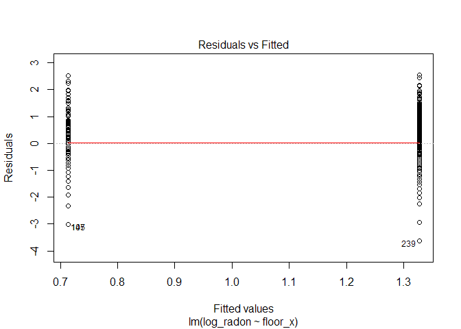<!-- -->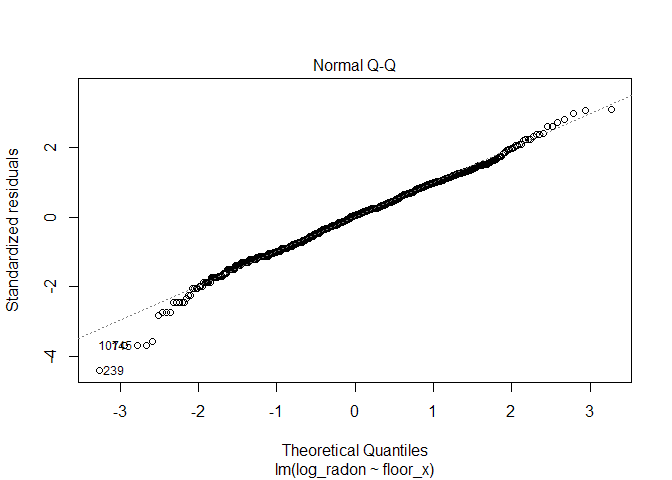<!-- -->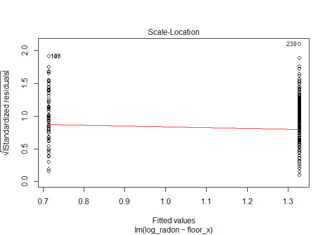<!-- -->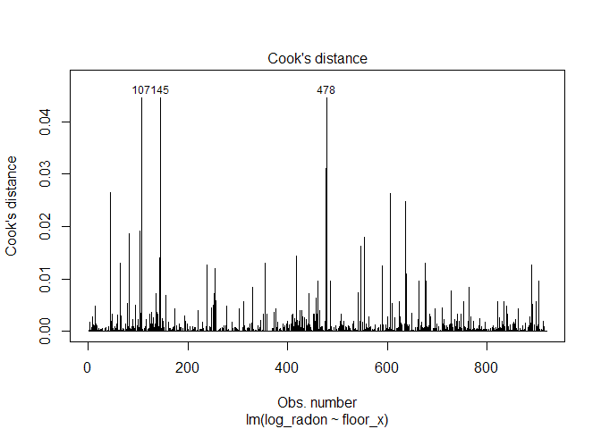<!-- -->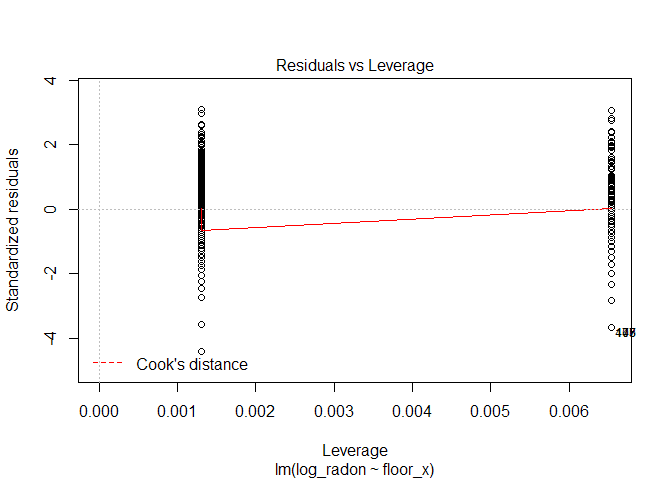<!-- -->

No problems here that we haven’t already discovered.

``` r
summary(poolfit)
```

    ## 
    ## Call:
    ## lm(formula = log_radon ~ floor_x, data = radon_dat)
    ## 
    ## Residuals:
    ##     Min      1Q  Median      3Q     Max 
    ## -3.6293 -0.5383  0.0342  0.5603  2.5486 
    ## 
    ## Coefficients:
    ##             Estimate Std. Error t value Pr(>|t|)    
    ## (Intercept)  1.32674    0.02972  44.640   <2e-16 ***
    ## floor_x     -0.61339    0.07284  -8.421   <2e-16 ***
    ## ---
    ## Signif. codes:  0 '***' 0.001 '**' 0.01 '*' 0.05 '.' 0.1 ' ' 1
    ## 
    ## Residual standard error: 0.8226 on 917 degrees of freedom
    ## Multiple R-squared:  0.07178,    Adjusted R-squared:  0.07077 
    ## F-statistic: 70.91 on 1 and 917 DF,  p-value: < 2.2e-16

Since “basement” is coded as 0, the `(Intercept)` is the estimated mean
radon in the basement. Since “first” is 1, the slope `floor_x` (or
)
here is estimating how radon in the first floor differs from the
basement. We see that the first floor on average has log radon 0.61
**lower** than the basement since the sign is negative.

Save s
in dataframe for use with ggplot:

``` r
cp_pred_df <- data.frame(ovrl_b0=coef(poolfit)[1],ovrl_b1=coef(poolfit)[2])
```

#### No pooling

In the no pooling analysis we will first investigate a model that allows
the mean radon to vary among counties but assumes that the relationship
between basement and first floor stays the same among counties. This
model is the **fixed effects** model, similar to the previous analysis
we did without the *floor* predictor but now we include `floor_x`. We
use the means parameterization (i.e. -1 to remove the overall intercept,
which by default would otherwise arbitrarily be radon in the basement of
the first county, sorted alphabetically).

``` r
npfit <- lm( log_radon ~ -1 + floor_x + county, data=radon_dat )

plot(npfit,1:5,ask=FALSE)
```

    ## Warning: not plotting observations with leverage one:
    ##   450, 509, 891

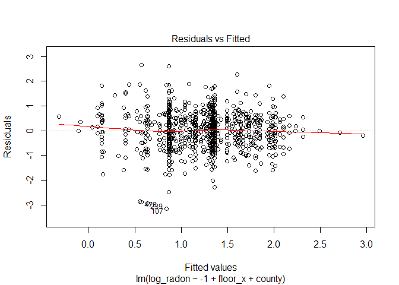<!-- -->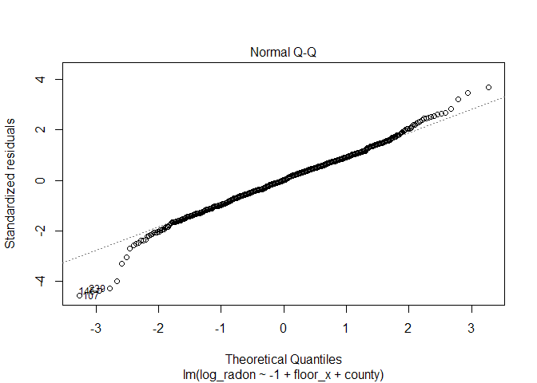<!-- -->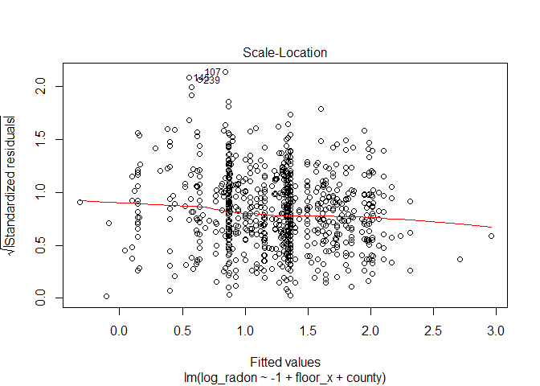<!-- -->

    ## Warning: not plotting observations with leverage one:
    ##   450, 509, 891

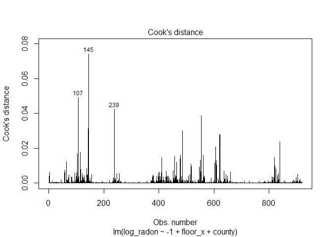<!-- -->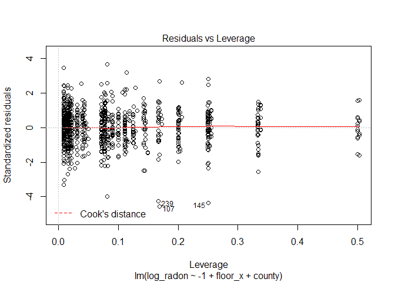<!-- -->

Nothing terribly concerning in the diagnostics. If we were going to use
this model in a critical application we ought to investigate the high
leverage points but for now we’ll note the warnings and wait to see if
the problem persists as we close in on a good model.

``` r
summary(npfit)
```

    ## 
    ## Call:
    ## lm(formula = log_radon ~ -1 + floor_x + county, data = radon_dat)
    ## 
    ## Residuals:
    ##      Min       1Q   Median       3Q      Max 
    ## -3.14595 -0.45405  0.00065  0.45376  2.65987 
    ## 
    ## Coefficients:
    ##                         Estimate Std. Error t value Pr(>|t|)    
    ## floor_x                 -0.72054    0.07352  -9.800  < 2e-16 ***
    ## countyAITKIN             0.84054    0.37866   2.220 0.026701 *  
    ## countyANOKA              0.87482    0.10498   8.333 3.23e-16 ***
    ## countyBECKER             1.52870    0.43946   3.479 0.000530 ***
    ## countyBELTRAMI           1.55272    0.28897   5.373 1.00e-07 ***
    ## countyBENTON             1.43257    0.37866   3.783 0.000166 ***
    ## countyBIG STONE          1.51301    0.43672   3.464 0.000558 ***
    ## countyBLUE EARTH         2.01216    0.20243   9.940  < 2e-16 ***
    ## countyBROWN              1.98958    0.37999   5.236 2.08e-07 ***
    ## countyCARLTON            1.00304    0.23931   4.191 3.07e-05 ***
    ## countyCARVER             1.56391    0.31099   5.029 6.04e-07 ***
    ## countyCASS               1.40113    0.33828   4.142 3.80e-05 ***
    ## countyCHIPPEWA           1.73025    0.37821   4.575 5.49e-06 ***
    ## countyCHISAGO            1.03872    0.30881   3.364 0.000804 ***
    ## countyCLAY               1.98838    0.20325   9.783  < 2e-16 ***
    ## countyCLEARWATER         1.33797    0.37999   3.521 0.000453 ***
    ## countyCOOK               0.66486    0.53487   1.243 0.214204    
    ## countyCOTTONWOOD         1.27480    0.38221   3.335 0.000890 ***
    ## countyCROW WING          1.12155    0.21913   5.118 3.83e-07 ***
    ## countyDAKOTA             1.33831    0.09541  14.026  < 2e-16 ***
    ## countyDODGE              1.80032    0.43672   4.122 4.13e-05 ***
    ## countyDOUGLAS            1.73399    0.25227   6.873 1.23e-11 ***
    ## countyFARIBAULT          0.63679    0.30905   2.060 0.039663 *  
    ## countyFILLMORE           1.39999    0.53613   2.611 0.009183 ** 
    ## countyFREEBORN           2.10162    0.25267   8.318 3.64e-16 ***
    ## countyGOODHUE            1.95072    0.20243   9.636  < 2e-16 ***
    ## countyHENNEPIN           1.36058    0.07422  18.332  < 2e-16 ***
    ## countyHOUSTON            1.77336    0.30978   5.725 1.45e-08 ***
    ## countyHUBBARD            1.24159    0.34115   3.639 0.000290 ***
    ## countyISANTI             1.05600    0.43672   2.418 0.015818 *  
    ## countyITASCA             0.92576    0.22807   4.059 5.39e-05 ***
    ## countyJACKSON            2.02057    0.33828   5.973 3.45e-09 ***
    ## countyKANABEC            1.23629    0.37821   3.269 0.001124 ** 
    ## countyKANDIYOHI          2.06187    0.37821   5.452 6.58e-08 ***
    ## countyKITTSON            1.59044    0.43946   3.619 0.000314 ***
    ## countyKOOCHICHING        0.81920    0.28897   2.835 0.004695 ** 
    ## countyLAC QUI PARLE      2.95897    0.53613   5.519 4.55e-08 ***
    ## countyLAKE               0.40209    0.25227   1.594 0.111345    
    ## countyLAKE OF THE WOODS  1.86772    0.37999   4.915 1.07e-06 ***
    ## countyLE SUEUR           1.74807    0.33860   5.163 3.05e-07 ***
    ## countyLINCOLN            2.31580    0.37866   6.116 1.48e-09 ***
    ## countyLYON               1.96715    0.26759   7.351 4.69e-13 ***
    ## countyMAHNOMEN           1.36098    0.75642   1.799 0.072343 .  
    ## countyMARSHALL           1.60224    0.25543   6.273 5.69e-10 ***
    ## countyMARTIN             1.04099    0.28609   3.639 0.000291 ***
    ## countyMCLEOD             1.29541    0.21101   6.139 1.28e-09 ***
    ## countyMEEKER             1.21461    0.33828   3.591 0.000349 ***
    ## countyMILLE LACS         0.88393    0.53613   1.649 0.099583 .  
    ## countyMORRISON           1.14812    0.25227   4.551 6.13e-06 ***
    ## countyMOWER              1.70211    0.21010   8.102 1.93e-15 ***
    ## countyMURRAY             2.49321    0.75642   3.296 0.001022 ** 
    ## countyNICOLLET           2.16504    0.37821   5.724 1.45e-08 ***
    ## countyNOBLES             1.92769    0.43672   4.414 1.15e-05 ***
    ## countyNORMAN             1.25080    0.43741   2.860 0.004348 ** 
    ## countyOLMSTED            1.30676    0.15802   8.270 5.28e-16 ***
    ## countyOTTER TAIL         1.61799    0.26885   6.018 2.64e-09 ***
    ## countyPENNINGTON         1.10110    0.43946   2.506 0.012415 *  
    ## countyPINE               0.76218    0.30905   2.466 0.013855 *  
    ## countyPIPESTONE          1.86092    0.37866   4.915 1.07e-06 ***
    ## countyPOLK               1.72178    0.37999   4.531 6.73e-06 ***
    ## countyPOPE               1.27939    0.53487   2.392 0.016979 *  
    ## countyRAMSEY             1.15873    0.13389   8.654  < 2e-16 ***
    ## countyREDWOOD            1.98301    0.33860   5.856 6.80e-09 ***
    ## countyRENVILLE           1.67070    0.43741   3.820 0.000144 ***
    ## countyRICE               1.84784    0.22817   8.099 1.97e-15 ***
    ## countyROCK               1.29912    0.53487   2.429 0.015357 *  
    ## countyROSEAU             1.66574    0.20648   8.067 2.50e-15 ***
    ## countySCOTT              1.80312    0.21101   8.545  < 2e-16 ***
    ## countySHERBURNE          1.09002    0.26743   4.076 5.02e-05 ***
    ## countySIBLEY             1.24245    0.37821   3.285 0.001062 ** 
    ## countyST LOUIS           0.86763    0.07096  12.227  < 2e-16 ***
    ## countySTEARNS            1.49184    0.15174   9.832  < 2e-16 ***
    ## countySTEELE             1.57990    0.23920   6.605 7.08e-11 ***
    ## countySTEVENS            1.79176    0.53487   3.350 0.000845 ***
    ## countySWIFT              0.98704    0.37821   2.610 0.009223 ** 
    ## countyTODD               1.72372    0.43741   3.941 8.80e-05 ***
    ## countyTRAVERSE           2.00844    0.37866   5.304 1.45e-07 ***
    ## countyWABASHA            1.82168    0.28609   6.367 3.17e-10 ***
    ## countyWADENA             1.28569    0.33956   3.786 0.000164 ***
    ## countyWASECA             0.61488    0.37866   1.624 0.104785    
    ## countyWASHINGTON         1.32952    0.11181  11.890  < 2e-16 ***
    ## countyWATONWAN           2.70953    0.43946   6.166 1.09e-09 ***
    ## countyWILKIN             2.23001    0.75642   2.948 0.003286 ** 
    ## countyWINONA             1.62292    0.21048   7.711 3.57e-14 ***
    ## countyWRIGHT             1.64535    0.20987   7.840 1.38e-14 ***
    ## countyYELLOW MEDICINE    1.18652    0.53487   2.218 0.026801 *  
    ## ---
    ## Signif. codes:  0 '***' 0.001 '**' 0.01 '*' 0.05 '.' 0.1 ' ' 1
    ## 
    ## Residual standard error: 0.7564 on 833 degrees of freedom
    ## Multiple R-squared:  0.7671, Adjusted R-squared:  0.7431 
    ## F-statistic: 31.91 on 86 and 833 DF,  p-value: < 2.2e-16

As in the complete pooling model, the slope (`floor_x`, or
)
is negative, indicating lower radon on the first floor. The estimate is
similar to, but a little different from, the complete pooling model. The
difference is because we’ve included another variable (*county*) in the
model, so the new estimate is after adjusting for radon levels among
counties. The `county` estimates are the mean radon level in the
basement for each county. In this parameterization, the `county`
estimates are the y-intercept for each county. The *p*-values are
meaningless because they are testing a hypothesis we have no interest in
(i.e. log(radon) = 0, or radon = 1, in county basements).

Plot the fitted model (G\&H Fig. 12.2) for 8 selected counties

``` r
np_pred_df <- data.frame(coef(summary(npfit))[-1,1:2],
                         rep(coef(npfit)[1],85),
                         unique(radon_dat$county))
names(np_pred_df) <- c("cty_b0","cty_b0_se","b1","county")
display8 <- c("LAC QUI PARLE","AITKIN","KOOCHICHING","DOUGLAS","CLAY","STEARNS",
              "RAMSEY","ST LOUIS")
radon_dat %>%
    filter(county %in% display8) %>%
    ggplot() +
    geom_abline(mapping=aes(slope=b1,intercept=cty_b0),
                data=filter(np_pred_df,county %in% display8),
                col="blue") +
    geom_point(mapping=aes(x=jitter(floor_x,0.2),y=log_radon)) +
    scale_x_continuous(breaks=c(0,1)) +
    facet_wrap(facets = ~ county,ncol=4) +
    labs(x="floor",
         y="ln(radon)",
         title="No pooling: estimates from linear model fit")
```

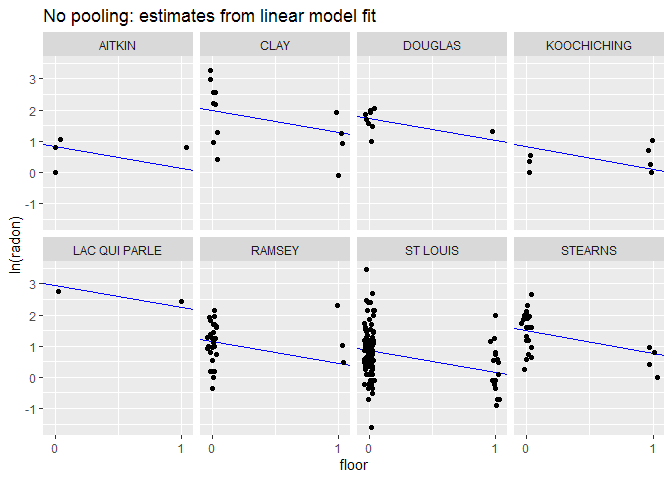<!-- -->

The features to notice here are that the slope (measuring the difference
in radon between floors) is the same across counties but the estimated
intercept differs. These features are due to the model we specified.

Plot the estimated intercepts (G\&H Fig. 12.3a)  
We will save this plot to compare to the partial pooling model. We first
need a jittered sample-size variable for plotting.

``` r
sample_size_df <- 
    radon_dat %>%
    group_by(county) %>%
    summarize(sample_size=n()) %>%
    mutate(sample_size_jit=jitter(sample_size)) #jitter added for plotting
np_pred_df <- cbind(np_pred_df,sample_size_df[,-1])

gh12.3a <- 
    ggplot(data=np_pred_df) +
    geom_hline(mapping=aes(yintercept=ovrl_b0),data=cp_pred_df,col="blue") +
    geom_point(mapping=aes(x=sample_size_jit,y=cty_b0)) +
    geom_linerange(mapping=aes(x=sample_size_jit,ymin=cty_b0-cty_b0_se,ymax=cty_b0+cty_b0_se)) +
    scale_x_continuous(trans="log",breaks=c(1,3,10,30,100)) +
    ylim(-0.1,3.5) +
    labs(x="Sample size in county j",y="Estimated intercept in county j",
         title="No pooling: estimates from linear model fit")
gh12.3a
```

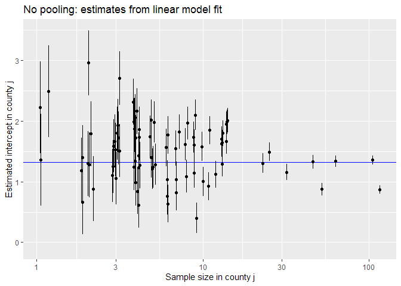<!-- -->

#### Partial pooling: multilevel model

In the multilevel model, we model the variation among counties in the
intercept:

``` r
ppfit <- lmer( log_radon ~ floor_x + (1|county), REML=FALSE, data=radon_dat )
```

The deviations of the county intercept from the mean intercept will be
modeled as a Normally distributed random variable.

Residual plot looks fine:

``` r
plot(ppfit)
```

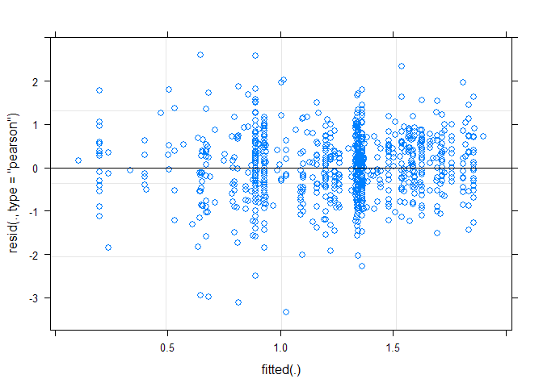<!-- -->

``` r
#` Examine the parameter estimates:
summary(ppfit)
```

    ## Linear mixed model fit by maximum likelihood  ['lmerMod']
    ## Formula: log_radon ~ floor_x + (1 | county)
    ##    Data: radon_dat
    ## 
    ##      AIC      BIC   logLik deviance df.resid 
    ##   2171.7   2190.9  -1081.8   2163.7      915 
    ## 
    ## Scaled residuals: 
    ##     Min      1Q  Median      3Q     Max 
    ## -4.4071 -0.6164  0.0056  0.6398  3.4288 
    ## 
    ## Random effects:
    ##  Groups   Name        Variance Std.Dev.
    ##  county   (Intercept) 0.1053   0.3245  
    ##  Residual             0.5703   0.7552  
    ## Number of obs: 919, groups:  county, 85
    ## 
    ## Fixed effects:
    ##             Estimate Std. Error t value
    ## (Intercept)  1.46116    0.05124  28.516
    ## floor_x     -0.69264    0.07036  -9.844
    ## 
    ## Correlation of Fixed Effects:
    ##         (Intr)
    ## floor_x -0.290

As in the model without a predictor, in the summary under `Random
effects` we now see estimates for two levels (or scales) of variance,
`county` (among counties) and `Residual` (among houses within counties).
Under `Fixed effects` we have the estimate for the common slope
`floor_x`, while the `(Intercept)` is the estimated mean radon at the
county scale (see below for more discussion of exactly how to interpret
this mean).

Plot the fitted model (G\&H Fig. 12.4) for 8 selected counties

``` r
pp_pred_df <- data.frame(coef(ppfit)$county,
                         se.ranef(ppfit)$county[,1],
                         sample_size_df$sample_size_jit,
                         unique(radon_dat$county))
names(pp_pred_df) <- c("cty_b0","b1","cty_b0_se","sample_size_jit","county")
pp_mean_df <- data.frame(ovrl_b0=fixef(ppfit)[1],
                         ovrl_b1=fixef(ppfit)[2])
radon_dat %>%
    filter(county %in% display8) %>%
    ggplot() +
    #no pooling line
    geom_abline(mapping=aes(slope=b1,intercept=cty_b0),
                data=filter(np_pred_df,county %in% display8),
                col="blue") +
    #partial pooling line
    geom_abline(mapping=aes(slope=b1,intercept=cty_b0),
                data=filter(pp_pred_df,county %in% display8),
                col="blue",
                lty=2) +
    #complete pooling line
    geom_abline(mapping=aes(slope=ovrl_b1,intercept=ovrl_b0),
                data=cp_pred_df,
                col="red") +
    #data
    geom_point(mapping=aes(x=jitter(floor_x,0.2),y=log_radon)) +
    scale_x_continuous(breaks=c(0,1)) +
    facet_wrap(facets = ~ county,ncol=4) +
    labs(x="floor",y="ln(radon)",
         title="Partial pooling (dashed): multilevel model, max likelihood estimates")
```

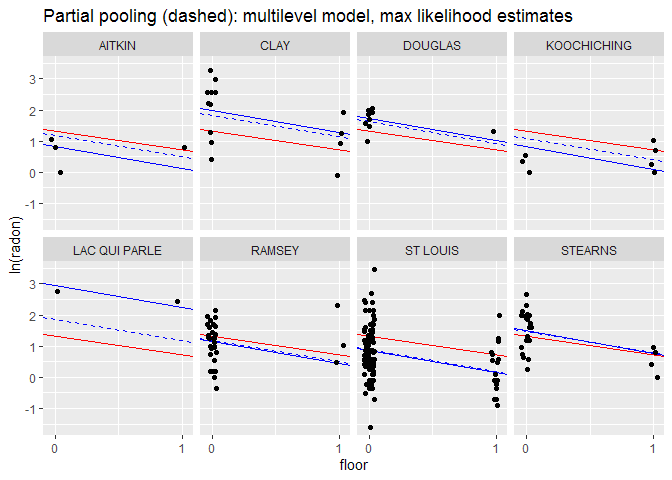<!-- -->

Partial pooling estimates (dashed blue line) compared to the no pooling
estimates (solid blue line), and the complete pooling estimate (red
line). The thing to notice here is that the partial pooling estimate is
shrunk away from the no pooling estimate toward the complete pooling
estimate. This shrinkage is greatest when there are few data points in a
county (e.g. Lac Qui Parle). When there are lots of data within a
county, the partial pooling estimate remains close to the no pooling
estimate (e.g. St Louis).

Plot the the estimated intercepts (G\&H Fig 12.3).  
Plot for partial pooling estimates:

``` r
gh12.3b <- 
    ggplot(data=pp_pred_df) +
    geom_hline(mapping=aes(yintercept=ovrl_b0),
               data=cp_pred_df,
               col="blue") +
    geom_hline(mapping=aes(yintercept=ovrl_b0),
               data=pp_mean_df,
               col="blue",
               lty=2) +
    geom_point(mapping=aes(x=sample_size_jit,y=cty_b0)) +
    geom_linerange(mapping=aes(x=sample_size_jit,
                               ymin=cty_b0-cty_b0_se,
                               ymax=cty_b0+cty_b0_se)) +
    scale_x_continuous(trans="log",breaks=c(1,3,10,30,100)) +
    ylim(-0.1,3.5) +
    labs(x="Sample size in county j",
         y="Estimated intercept in county j",
         title="Partial pooling: multilevel model, max likelihood")
```

Plot no pooling vs partial pooling side by side

``` r
grid.arrange(gh12.3a, gh12.3b, nrow = 1) 
```

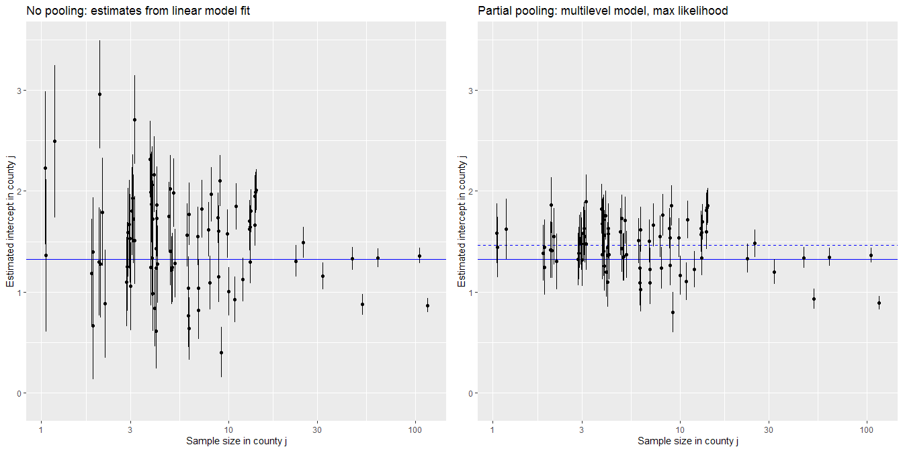<!-- -->

The estimates for the county intercepts are shrunk toward the
county-scale mean (dashed blue line). The county-scale mean is the mean
intercept among counties estimated by the multilevel model. Notice that
the county mean is higher than the complete pooling intercept (solid
blue line). This is because the complete pooling intercept is influenced
by the six or so most-sampled counties (they make up a large amount of
the total dataset used to fit the complete pooling model), which happen
to have lower radon than the mean across counties. In other words, the
complete pooling estimate is weighted by the number of samples in a
county, whereas the partial pooling estimate is not. This brings up an
interesting situation: what if we wanted to estimate the mean radon
level for houses in Minnesota? The multilevel model allows us to do
that. It would be the weighted mean across counties, where the weights
are the number of houses in a county (not the number of sampled houses).
Counties with more houses contribute more to the mean radon level in
Minnesota houses. The county-scale mean is not the “grand mean” or the
mean for Minnesota houses, it is the mean among Minnesota counties.

#### Partial pooling, Bayesian fit

The Bayesian fit of the multilevel model using `stan_lmer()` is
straightforward and gives almost the same result as `lmer()`. The code
is substantially similar to the situation we consider next - adding a
county-level predictor - so we’ll just skip right to that. See Part III.
