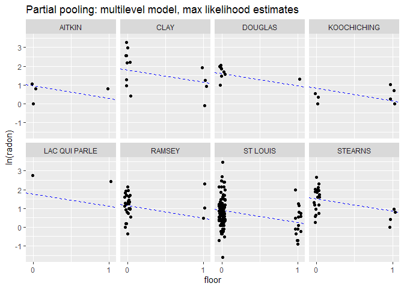

Multilevel model of radon levels III
================
Brett Melbourne
1 Nov 2018 (updated 27 Feb 2020)

Chapter 12 of Gelman & Hill  
See `data/radon_MN_about.txt` and  
`data/radon_MN_U_about.txt` for data source  

This is part III. Part I was EDA and introduction to partial pooling and
shrinkage (G\&H 12.2). Part II considered a house-level predictor (G\&H
12.3-4). Here, we add a county-level predictor (G\&H 12.6).

``` r
library(lme4)      #max lik multilevel: lmer(), glmer() etc
library(arm)       #for se.ranef()
library(ggplot2)
library(gridExtra) #arranging multiple plots
library(dplyr)
library(rstan)     #for extract()
library(rstanarm)  #Bayesian multilevel: stan_lmer(), stan_glmer() etc
options(mc.cores = parallel::detectCores())
theme_set(theme_grey()) #rstanarm overrides default ggplot theme: set it back
```

Read in data and manipulate as required for analysis (see Parts I & II)

``` r
radon_dat <- read.csv("data/radon_MN.csv", as.is=TRUE)
radon_dat$log_radon <- log(ifelse(radon_dat$radon==0,0.1,radon_dat$radon))
radon_dat$county <- factor(radon_dat$county)
radon_dat$floor_x <- ifelse(radon_dat$floor=="basement",0,1)
head(radon_dat)
```

    ##      floor radon county log_radon floor_x
    ## 1    first   2.2 AITKIN 0.7884574       1
    ## 2 basement   2.2 AITKIN 0.7884574       0
    ## 3 basement   2.9 AITKIN 1.0647107       0
    ## 4 basement   1.0 AITKIN 0.0000000       0
    ## 5 basement   3.1  ANOKA 1.1314021       0
    ## 6 basement   2.5  ANOKA 0.9162907       0

### G\&H 12.6. Analysis with a county level predictor (uranium)

The predictor at the county level is uranium. That is, measurement of
uranium was not done house by house. The dataset has just one value for
uranium per county.

``` r
uranium_dat <- read.csv("data/radon_MN_U.csv", as.is=TRUE)
head(uranium_dat)
```

    ##      county     uppm
    ## 1    AITKIN 0.502054
    ## 2     ANOKA 0.428565
    ## 3    BECKER 0.892741
    ## 4  BELTRAMI 0.552472
    ## 5    BENTON 0.866849
    ## 6 BIG STONE 1.472640

Log uranium

``` r
uranium_dat$logu <- log(uranium_dat$uppm)
```

Plot of the uranium data  
This is a predictor variable, so we are not necessarily interested in
its distribution (thus, I do not choose a histogram here).

``` r
plot(x=sort(uranium_dat$logu),
     y=1:85,
     yaxt="n",
     ylab="County (ordered)",
     xlab="Log( uranium (ppm) )")
```

<!-- -->

I don’t see anything untoward in this plot.

Perhaps counterintuitively, we now add these county-scale uranium data
to the dataframe that contains all our other data. The data will then be
in a tidy data format. Each row contains an observation for the level of
radon in a house but we add a column for the county-scale uranium
associated with each house. This means that the county-scale uranium
values are repeated multiple times in the dataset. This might feel like
cheating - aren’t we pretending there are more uranium data than we
actually have? No, we are not. There is no problem here because uranium
will be a predictor variable. Furthermore, in the multilevel model, we
will be estimating the effect of uranium (*logu*) at the appropriate
scale by including *county* as a grouping variable.

``` r
radon_dat <- merge(radon_dat,uranium_dat,by="county",all.x=TRUE)
radon_dat[sample(1:nrow(radon_dat),50),] #print a sample of 50 rows to check
```

    ##            county    floor radon  log_radon floor_x     uppm        logu
    ## 598        RAMSEY basement   1.7  0.5306283       0 0.658327 -0.41805351
    ## 742      ST LOUIS basement   1.9  0.6418539       0 0.622088 -0.47467372
    ## 459      MARSHALL basement   8.3  2.1162555       0 1.013860  0.01376483
    ## 798       STEARNS basement   2.6  0.9555114       0 1.123440  0.11639541
    ## 356      HENNEPIN basement   2.6  0.9555114       0 0.907991 -0.09652081
    ## 44          ANOKA    first   1.8  0.5877867       1 0.428565 -0.84731286
    ## 145    COTTONWOOD    first   0.0 -2.3025851       1 1.404330  0.33956032
    ## 435      LE SUEUR basement   4.5  1.5040774       0 1.214640  0.19444774
    ## 55          ANOKA basement   1.9  0.6418539       0 0.428565 -0.84731286
    ## 814       STEVENS basement   4.5  1.5040774       0 1.601240  0.47077833
    ## 614          RICE basement  19.0  2.9444390       0 1.213060  0.19314609
    ## 535       OLMSTED basement   7.8  2.0541237       0 1.275260  0.24315008
    ## 635        ROSEAU    first   1.7  0.5306283       1 0.808928 -0.21204536
    ## 849    WASHINGTON basement   6.5  1.8718022       0 0.862876 -0.14748428
    ## 76     BLUE EARTH basement   7.2  1.9740810       0 1.312080  0.27161366
    ## 519        NORMAN    first   1.6  0.4700036       1 1.303720  0.26522172
    ## 552    PENNINGTON basement   5.8  1.7578579       0 0.928646 -0.07402767
    ## 854    WASHINGTON basement   1.0  0.0000000       0 0.862876 -0.14748428
    ## 85     BLUE EARTH basement   6.9  1.9315214       0 1.312080  0.27161366
    ## 866    WASHINGTON basement   1.9  0.6418539       0 0.862876 -0.14748428
    ## 171        DAKOTA basement   9.6  2.2617631       0 0.976144 -0.02414516
    ## 214        DAKOTA basement   3.8  1.3350011       0 0.976144 -0.02414516
    ## 826       WABASHA basement   5.9  1.7749524       0 1.161930  0.15008242
    ## 239     FARIBAULT basement   0.1 -2.3025851       0 1.343160  0.29502505
    ## 66       BELTRAMI    first   4.4  1.4816045       1 0.552472 -0.59335253
    ## 419 LAC QUI PARLE basement  16.0  2.7725887       0 1.364830  0.31102988
    ## 90          BROWN    first   4.0  1.3862944       1 1.319930  0.27757870
    ## 127          CLAY basement  26.6  3.2809112       0 1.410270  0.34378118
    ## 212        DAKOTA basement   4.8  1.5686159       0 0.976144 -0.02414516
    ## 385        ITASCA basement   2.6  0.9555114       0 0.515124 -0.66334763
    ## 365      HENNEPIN basement   4.2  1.4350845       0 0.907991 -0.09652081
    ## 268      HENNEPIN basement   1.6  0.4700036       0 0.907991 -0.09652081
    ## 800       STEARNS basement   1.9  0.6418539       0 1.123440  0.11639541
    ## 527       OLMSTED basement   3.2  1.1631508       0 1.275260  0.24315008
    ## 629        ROSEAU    first   3.4  1.2237754       1 0.808928 -0.21204536
    ## 792       STEARNS    first   1.5  0.4054651       1 1.123440  0.11639541
    ## 762      ST LOUIS    first   1.8  0.5877867       1 0.622088 -0.47467372
    ## 329      HENNEPIN    first   7.6  2.0281482       1 0.907991 -0.09652081
    ## 548    OTTER TAIL basement   3.2  1.1631508       0 0.814867 -0.20473037
    ## 223         DODGE basement   7.2  1.9740810       0 1.301940  0.26385546
    ## 867    WASHINGTON basement   6.6  1.8870696       0 0.862876 -0.14748428
    ## 802       STEARNS basement   5.0  1.6094379       0 1.123440  0.11639541
    ## 111          CASS basement   5.3  1.6677068       0 0.544319 -0.60821981
    ## 502         MOWER basement   8.0  2.0794415       0 1.298140  0.26093247
    ## 317      HENNEPIN basement   2.7  0.9932518       0 0.907991 -0.09652081
    ## 123          CLAY    first   0.9 -0.1053605       1 1.410270  0.34378118
    ## 364      HENNEPIN basement   3.0  1.0986123       0 0.907991 -0.09652081
    ## 116      CHIPPEWA basement   9.4  2.2407097       0 1.314800  0.27368456
    ## 507         MOWER basement  24.0  3.1780538       0 1.298140  0.26093247
    ## 457      MARSHALL basement  48.2  3.8753590       0 1.013860  0.01376483

Alternatively, we could have used the function `left_join` from
`dplyr`  
`left_join(radon_dat, uranium_dat, by = "county")` or, more literally  
`for ( i in 1:nrow(radon_dat) ) { radon_dat$logu[i] <-
uranium_dat$logu[uranium_dat$county==radon_dat$county[i]] }`

#### Partial pooling: multilevel model

In the multilevel model, we model the variation among counties in the
intercept but now we allow the intercept to be a function of the uranium
level in the county.

``` r
ppfit <- lmer( log_radon ~ floor_x + logu + (1|county), REML=FALSE, data=radon_dat )
```

The deviations of the county intercepts from the county-scale mean
intercept will be modeled as a Normally distributed random variable.

Residual plot looks fine.

``` r
plot(ppfit)
```

<!-- -->

As in the model without a predictor, in the summary we have estimates
for two levels (or scales) of variance, county (among counties) and
residual (among houses within counties):

``` r
summary(ppfit)
```

    ## Linear mixed model fit by maximum likelihood  ['lmerMod']
    ## Formula: log_radon ~ floor_x + logu + (1 | county)
    ##    Data: radon_dat
    ## 
    ##      AIC      BIC   logLik deviance df.resid 
    ##   2132.8   2156.9  -1061.4   2122.8      914 
    ## 
    ## Scaled residuals: 
    ##     Min      1Q  Median      3Q     Max 
    ## -4.9976 -0.6163  0.0307  0.6561  3.3794 
    ## 
    ## Random effects:
    ##  Groups   Name        Variance Std.Dev.
    ##  county   (Intercept) 0.02127  0.1458  
    ##  Residual             0.57499  0.7583  
    ## Number of obs: 919, groups:  county, 85
    ## 
    ## Fixed effects:
    ##             Estimate Std. Error t value
    ## (Intercept)  1.46427    0.03714  39.421
    ## floor_x     -0.66644    0.06865  -9.708
    ## logu         0.72320    0.08965   8.067
    ## 
    ## Correlation of Fixed Effects:
    ##         (Intr) flor_x
    ## floor_x -0.361       
    ## logu     0.154 -0.011

Compared to our previous analysis without uranium (*logu*) as a
county-level predictor, the county-level variance is now markedly
reduced. The variance (0.02) is now about five times less than without
uranium as a predictor (0.1) because *logu* is accounting for most of
the county-level variance.

The following will extract the fixed effects (the estimates of
\(\beta_0\), \(\beta_1\), \(\beta_2\)):

``` r
fixef(ppfit)
```

    ## (Intercept)     floor_x        logu 
    ##   1.4642651  -0.6664446   0.7232005

The following will extract the random effects (or county errors,
i.e. the deviations of each county from \(\beta_0\), the county-scale
mean):

``` r
ranef(ppfit)$county
```

    ##                     (Intercept)
    ## AITKIN            -0.0179049646
    ## ANOKA              0.0132967844
    ## BECKER             0.0110287605
    ## BELTRAMI           0.1000862746
    ## BENTON             0.0074905025
    ## BIG STONE         -0.0230891716
    ## BLUE EARTH         0.1172682716
    ## BROWN              0.0383440996
    ## CARLTON           -0.0611033289
    ## CARVER             0.0005928622
    ## CASS               0.0587970451
    ## CHIPPEWA           0.0087706179
    ## CHISAGO            0.0192949042
    ## CLAY               0.0887147182
    ## CLEARWATER        -0.0141832028
    ## COOK              -0.0299062147
    ## COTTONWOOD        -0.0612961592
    ## CROW WING          0.0313021082
    ## DAKOTA            -0.0783189392
    ## DODGE              0.0145052120
    ## DOUGLAS            0.0377374372
    ## FARIBAULT         -0.1906698259
    ## FILLMORE          -0.0269580937
    ## FREEBORN           0.1156793668
    ## GOODHUE            0.1148136374
    ## HENNEPIN          -0.0314492884
    ## HOUSTON           -0.0132744002
    ## HUBBARD            0.0053968669
    ## ISANTI             0.0135324630
    ## ITASCA            -0.0169968453
    ## JACKSON            0.0519435081
    ## KANABEC           -0.0244053653
    ## KANDIYOHI          0.0667917792
    ## KITTSON            0.0095636948
    ## KOOCHICHING       -0.0078642023
    ## LAC QUI PARLE      0.0855960534
    ## LAKE              -0.1418612366
    ## LAKE OF THE WOODS  0.1120497587
    ## LE SUEUR           0.0206570544
    ## LINCOLN            0.0665355006
    ## LYON               0.0480987242
    ## MAHNOMEN          -0.0075429414
    ## MARSHALL           0.0244664210
    ## MARTIN            -0.1133098250
    ## MCLEOD            -0.0932052926
    ## MEEKER            -0.0416670504
    ## MILLE LACS        -0.0313718324
    ## MORRISON          -0.0636186203
    ## MOWER              0.0132526911
    ## MURRAY             0.0264114643
    ## NICOLLET           0.0671959487
    ## NOBLES             0.0169995019
    ## NORMAN            -0.0422783607
    ## OLMSTED           -0.1564745281
    ## OTTER TAIL         0.0642765225
    ## PENNINGTON        -0.0345269495
    ## PINE              -0.1076988162
    ## PIPESTONE          0.0047696912
    ## POLK               0.0048996592
    ## POPE              -0.0267387607
    ## RAMSEY            -0.0044843913
    ## REDWOOD            0.0379257059
    ## RENVILLE          -0.0086726605
    ## RICE               0.0691085586
    ## ROCK              -0.0376774382
    ## ROSEAU             0.1105065722
    ## SCOTT              0.0898010649
    ## SHERBURNE          0.0274041021
    ## SIBLEY            -0.0506964985
    ## ST LOUIS          -0.2115118356
    ## STEARNS           -0.0313500424
    ## STEELE            -0.0214618672
    ## STEVENS           -0.0008935432
    ## SWIFT             -0.0909601372
    ## TODD               0.0274960756
    ## TRAVERSE           0.0220113029
    ## WABASHA            0.0495946771
    ## WADENA             0.0446047001
    ## WASECA            -0.1310090674
    ## WASHINGTON        -0.0213916091
    ## WATONWAN           0.1075370170
    ## WILKIN             0.0212238466
    ## WINONA            -0.0613104677
    ## WRIGHT             0.0785885364
    ## YELLOW MEDICINE   -0.0368282910

The function `coef()` will return the county coefficients. Here are the
first six:

``` r
head(coef(ppfit)$county)
```

    ##           (Intercept)    floor_x      logu
    ## AITKIN       1.446360 -0.6664446 0.7232005
    ## ANOKA        1.477562 -0.6664446 0.7232005
    ## BECKER       1.475294 -0.6664446 0.7232005
    ## BELTRAMI     1.564351 -0.6664446 0.7232005
    ## BENTON       1.471756 -0.6664446 0.7232005
    ## BIG STONE    1.441176 -0.6664446 0.7232005

The first coefficient column here (`(Intercept)`) is the sum of the
overall intercept \(\beta_0\) and the county random effects. That is:

``` r
head( fixef(ppfit)[1] + ranef(ppfit)$county )
```

    ##           (Intercept)
    ## AITKIN       1.446360
    ## ANOKA        1.477562
    ## BECKER       1.475294
    ## BELTRAMI     1.564351
    ## BENTON       1.471756
    ## BIG STONE    1.441176

We will use `coef()` next to form a dataframe for plotting.

Plot the fitted model (G\&H Fig. 12.5) for 8 selected counties:

``` r
pp_pred_df <- data.frame(coef(ppfit)$county,
                         se.ranef(ppfit)$county[,1],
                         unique(radon_dat$county))
names(pp_pred_df) <- c("cty_b0","b1","b2","cty_b0_se","county")

# Calculate the intercepts for each county (this will be the log(radon) level in
# a basement):
pp_pred_df$cty_b0 <- pp_pred_df$cty_b0 + pp_pred_df$b2 * uranium_dat$logu

# Add uranium data to the county-scale results dataframe
pp_pred_df <- cbind(pp_pred_df,uranium_dat[,-1])


display8 <- c("LAC QUI PARLE","AITKIN","KOOCHICHING","DOUGLAS","CLAY","STEARNS",
              "RAMSEY","ST LOUIS")
radon_dat %>%
    filter(county %in% display8) %>%
    ggplot() +
    geom_abline(mapping=aes(slope=b1,intercept=cty_b0),
                data=filter(pp_pred_df,county %in% display8),
                col="blue",
                lty=2) +
    geom_point(mapping=aes(x=jitter(floor_x,0.2),y=log_radon)) +
    scale_x_continuous(breaks=c(0,1)) +
    facet_wrap(facets = ~ county,ncol=4) +
    labs(x="floor",
         y="ln(radon)",
         title="Partial pooling: multilevel model, max likelihood estimates")
```

<!-- -->

These estimates are not very different from the analysis that did not
include uranium as a predictor (see Part II). The difference is that the
intercepts in each panel are now predicted by the uranium level in a
county.

Plot the estimated intercepts (G\&H Fig. 12.6):

``` r
gh12.6 <- 
    ggplot(data=pp_pred_df) +
    geom_abline(intercept=fixef(ppfit)[1],slope=fixef(ppfit)[3],col="blue") +
    geom_point(mapping=aes(x=logu,y=cty_b0)) +
    geom_linerange(mapping=aes(x=logu,ymin=cty_b0-cty_b0_se,ymax=cty_b0+cty_b0_se)) +
    ylim(0.5,2.05) +
    labs(x="Uranium level in county (log-ppm)",
         y="Estimated intercept in county j",
         title="Partial pooling: multilevel model, max likelihood estimates")
gh12.6
```

<!-- -->

This plot is the same as in Fig. 12.6 of G\&H, except that their plot
appears to be for the radon level on the first floor rather than the
basement (thus their plot is not strictly for the intercepts as labelled
on the y-axis).

#### Bayesian fit of multilevel model

The Bayesian fit is straightforward but may take a minute or two.

``` r
ppfit_bayes <- stan_lmer( log_radon ~ floor_x + logu + (1|county), data=radon_dat )
```

Print a selection of columns from the summary

``` r
print(summary(ppfit_bayes)[,c("mean","sd","n_eff","Rhat")],digits=3)
```

    ##                                              mean     sd n_eff  Rhat
    ## (Intercept)                              1.46e+00 0.0385  2616 1.000
    ## floor_x                                 -6.66e-01 0.0686  5404 1.000
    ## logu                                     7.24e-01 0.0935  2674 1.002
    ## b[(Intercept) county:AITKIN]            -2.16e-02 0.1482  6227 1.000
    ## b[(Intercept) county:ANOKA]              8.27e-03 0.1030  3006 1.001
    ## b[(Intercept) county:BECKER]             1.31e-02 0.1464  5174 1.000
    ## b[(Intercept) county:BELTRAMI]           1.09e-01 0.1479  3387 1.000
    ## b[(Intercept) county:BENTON]             4.82e-03 0.1485  5428 1.000
    ## b[(Intercept) county:BIG_STONE]         -2.43e-02 0.1474  4485 1.000
    ## b[(Intercept) county:BLUE_EARTH]         1.23e-01 0.1300  3399 1.000
    ## b[(Intercept) county:BROWN]              4.71e-02 0.1511  5056 1.000
    ## b[(Intercept) county:CARLTON]           -7.00e-02 0.1345  4285 1.000
    ## b[(Intercept) county:CARVER]             1.83e-03 0.1419  5292 0.999
    ## b[(Intercept) county:CASS]               6.43e-02 0.1484  4251 1.000
    ## b[(Intercept) county:CHIPPEWA]           1.30e-02 0.1423  4388 1.000
    ## b[(Intercept) county:CHISAGO]            1.88e-02 0.1398  4775 1.000
    ## b[(Intercept) county:CLAY]               9.39e-02 0.1234  3601 1.000
    ## b[(Intercept) county:CLEARWATER]        -1.96e-02 0.1421  4776 1.000
    ## b[(Intercept) county:COOK]              -3.72e-02 0.1509  5091 1.000
    ## b[(Intercept) county:COTTONWOOD]        -6.97e-02 0.1532  3714 1.000
    ## b[(Intercept) county:CROW_WING]          3.15e-02 0.1288  5470 1.000
    ## b[(Intercept) county:DAKOTA]            -7.70e-02 0.0880  3861 0.999
    ## b[(Intercept) county:DODGE]              1.54e-02 0.1506  4831 0.999
    ## b[(Intercept) county:DOUGLAS]            4.17e-02 0.1303  4380 1.000
    ## b[(Intercept) county:FARIBAULT]         -2.12e-01 0.1730  1903 1.001
    ## b[(Intercept) county:FILLMORE]          -3.16e-02 0.1567  4594 1.000
    ## b[(Intercept) county:FREEBORN]           1.27e-01 0.1463  3072 1.000
    ## b[(Intercept) county:GOODHUE]            1.18e-01 0.1304  3378 1.000
    ## b[(Intercept) county:HENNEPIN]          -3.11e-02 0.0724  3677 0.999
    ## b[(Intercept) county:HOUSTON]           -1.47e-02 0.1432  5189 0.999
    ## b[(Intercept) county:HUBBARD]            3.60e-03 0.1476  6537 0.999
    ## b[(Intercept) county:ISANTI]             1.96e-02 0.1449  5683 1.001
    ## b[(Intercept) county:ITASCA]            -1.98e-02 0.1283  5442 1.000
    ## b[(Intercept) county:JACKSON]            5.51e-02 0.1434  4469 1.000
    ## b[(Intercept) county:KANABEC]           -2.48e-02 0.1502  6463 0.999
    ## b[(Intercept) county:KANDIYOHI]          7.96e-02 0.1560  4649 1.000
    ## b[(Intercept) county:KITTSON]            1.08e-02 0.1532  5914 0.999
    ## b[(Intercept) county:KOOCHICHING]       -1.18e-02 0.1354  5202 1.000
    ## b[(Intercept) county:LAC_QUI_PARLE]      9.94e-02 0.1615  3555 1.000
    ## b[(Intercept) county:LAKE]              -1.53e-01 0.1548  2821 1.002
    ## b[(Intercept) county:LAKE_OF_THE_WOODS]  1.31e-01 0.1652  2707 1.000
    ## b[(Intercept) county:LE_SUEUR]           2.18e-02 0.1419  4518 1.000
    ## b[(Intercept) county:LINCOLN]            7.64e-02 0.1521  4302 1.000
    ## b[(Intercept) county:LYON]               5.37e-02 0.1403  4760 1.000
    ## b[(Intercept) county:MAHNOMEN]          -9.30e-03 0.1617  5079 0.999
    ## b[(Intercept) county:MARSHALL]           2.77e-02 0.1365  6298 1.000
    ## b[(Intercept) county:MARTIN]            -1.23e-01 0.1501  3121 1.000
    ## b[(Intercept) county:MCLEOD]            -9.79e-02 0.1291  3286 1.000
    ## b[(Intercept) county:MEEKER]            -4.76e-02 0.1427  4384 1.000
    ## b[(Intercept) county:MILLE_LACS]        -4.17e-02 0.1551  4708 1.000
    ## b[(Intercept) county:MORRISON]          -6.87e-02 0.1352  4190 1.001
    ## b[(Intercept) county:MOWER]              1.44e-02 0.1234  5384 1.000
    ## b[(Intercept) county:MURRAY]             3.28e-02 0.1629  4612 1.000
    ## b[(Intercept) county:NICOLLET]           7.44e-02 0.1513  3823 1.000
    ## b[(Intercept) county:NOBLES]             2.15e-02 0.1508  5391 1.000
    ## b[(Intercept) county:NORMAN]            -4.97e-02 0.1504  4301 1.000
    ## b[(Intercept) county:OLMSTED]           -1.60e-01 0.1218  3075 0.999
    ## b[(Intercept) county:OTTER_TAIL]         6.78e-02 0.1359  3624 1.000
    ## b[(Intercept) county:PENNINGTON]        -3.88e-02 0.1472  4366 1.000
    ## b[(Intercept) county:PINE]              -1.19e-01 0.1540  3008 1.000
    ## b[(Intercept) county:PIPESTONE]          6.97e-03 0.1435  4991 1.000
    ## b[(Intercept) county:POLK]               5.37e-03 0.1485  4819 0.999
    ## b[(Intercept) county:POPE]              -2.95e-02 0.1548  5036 1.000
    ## b[(Intercept) county:RAMSEY]            -5.65e-03 0.1018  4205 1.000
    ## b[(Intercept) county:REDWOOD]            4.43e-02 0.1436  4751 1.001
    ## b[(Intercept) county:RENVILLE]          -8.70e-03 0.1523  4651 1.000
    ## b[(Intercept) county:RICE]               7.49e-02 0.1349  4581 1.000
    ## b[(Intercept) county:ROCK]              -4.64e-02 0.1520  4419 1.000
    ## b[(Intercept) county:ROSEAU]             1.18e-01 0.1302  3764 1.001
    ## b[(Intercept) county:SCOTT]              9.58e-02 0.1308  3342 1.001
    ## b[(Intercept) county:SHERBURNE]          2.62e-02 0.1365  4768 1.000
    ## b[(Intercept) county:SIBLEY]            -5.59e-02 0.1442  4514 1.000
    ## b[(Intercept) county:ST_LOUIS]          -2.08e-01 0.0863  1661 1.001
    ## b[(Intercept) county:STEARNS]           -3.01e-02 0.1103  6082 1.000
    ## b[(Intercept) county:STEELE]            -2.26e-02 0.1320  5438 1.000
    ## b[(Intercept) county:STEVENS]           -8.92e-04 0.1534  5477 1.000
    ## b[(Intercept) county:SWIFT]             -1.06e-01 0.1515  3949 1.001
    ## b[(Intercept) county:TODD]               3.41e-02 0.1559  5083 1.000
    ## b[(Intercept) county:TRAVERSE]           2.40e-02 0.1461  4862 1.000
    ## b[(Intercept) county:WABASHA]            5.54e-02 0.1369  5031 1.000
    ## b[(Intercept) county:WADENA]             5.03e-02 0.1469  4867 1.000
    ## b[(Intercept) county:WASECA]            -1.51e-01 0.1646  2942 1.000
    ## b[(Intercept) county:WASHINGTON]        -2.08e-02 0.0915  4242 1.000
    ## b[(Intercept) county:WATONWAN]           1.25e-01 0.1621  3141 1.000
    ## b[(Intercept) county:WILKIN]             2.78e-02 0.1567  4994 0.999
    ## b[(Intercept) county:WINONA]            -6.68e-02 0.1296  5202 0.999
    ## b[(Intercept) county:WRIGHT]             8.12e-02 0.1237  3678 1.001
    ## b[(Intercept) county:YELLOW_MEDICINE]   -4.60e-02 0.1570  4955 1.000
    ## sigma                                    7.60e-01 0.0185  3595 1.000
    ## Sigma[county:(Intercept),(Intercept)]    2.63e-02 0.0162  1072 1.004
    ## mean_PPD                                 1.23e+00 0.0353  5487 1.000
    ## log-posterior                           -1.18e+03 9.3683   760 1.003

We see that the `Rhat`s are all close to 1, suggesting the chains have
converged, and the effective number of replicates `n_eff` is high or
maximal. The parameter estimates are very similar to the maximum
likelihood fit. The parameterization is important though: `sigma` with a
small “s” is the standard deviation at the lowest scale, whereas `Sigma`
with a big “S” is the variance at the county scale. You need to square
`sigma` to obtain the variance and compare with the residual variance in
the frequentist analysis, whereas `Sigma` is directly comparable with
the county variance in the frequentist analysis.

Diagnostics: inspect convergence, histograms for posteriors etc

``` r
launch_shinystan(ppfit_bayes)
```

The diagnostics look good. Trace plots show convergence. Histograms of
parameters are all fairly smooth and symmetric. The one exception is the
county `Sigma`, which has a longer right-tailed distribution. That’s
because `Sigma` is a variance, which typically have such a distribution.

Extract posterior samples:

``` r
samples <- extract(ppfit_bayes$stanfit)
names(samples)
```

    ## [1] "alpha"    "beta"     "b"        "aux"      "theta_L"  "mean_PPD" "lp__"

``` r
str(samples$alpha) #Samples of overall mean. Matrix: samples by row, 1 col
```

    ##  num [1:4000, 1] 1.54 1.43 1.48 1.42 1.46 ...
    ##  - attr(*, "dimnames")=List of 2
    ##   ..$ iterations: NULL
    ##   ..$           : NULL

``` r
str(samples$b) #Samples of county deviations. Matrix: samples by row, 86 cols
```

    ##  num [1:4000, 1:86] 0.2377 -0.1654 0.207 -0.172 0.0802 ...
    ##  - attr(*, "dimnames")=List of 2
    ##   ..$ iterations: NULL
    ##   ..$           : NULL

I’m still not sure what the 86th b parameter is but the first 85 are the
county samples.

``` r
str(samples$beta) #Samples of $\beta$s. Matrix: samples by row, 2 cols.
```

    ##  num [1:4000, 1:2] -0.758 -0.62 -0.687 -0.687 -0.728 ...
    ##  - attr(*, "dimnames")=List of 2
    ##   ..$ iterations: NULL
    ##   ..$           : NULL

County means in basements are alpha + b + \(\beta_2\) \* logu, so we’ll
first derive posterior samples for the county mean and then calculate
summaries of their posterior distributions:

``` r
# Derive posterior samples for county means
countysamples <- samples$b[,1:85] * NA
for ( i in 1:85 ) {
    countysamples[,i] <- samples$alpha + samples$b[,i] + samples$beta[,2] * uranium_dat$logu[i]
}
# Now calculate mean and standard deviation of the posterior distributions for
# the county means.
countypostmns <- rep(NA,85)
countypostses <- rep(NA,85)
for ( i in 1:85 ) {
    countypostmns[i] <- mean(countysamples[,i])
    countypostses[i] <- sd(countysamples[,i])
}
```

Plot of posterior means and standard deviations (and compare to the
maximum likelihood fit):

``` r
ppbayes_pred_df <- data.frame(cty_mn=countypostmns,cty_se=countypostses)
ppbayes_pred_df <- cbind(ppbayes_pred_df,uranium_dat) #Add U to the dataframe

gh12.6_bayes <-
    ggplot(data=ppbayes_pred_df) +
    geom_abline(intercept=mean(samples$alpha),
                slope=mean(samples$beta[,2]),
                col="blue",
                lty=2) +
    geom_point(mapping=aes(x=logu,
                           y=cty_mn)) +
    geom_linerange(mapping=aes(x=logu,
                               ymin=cty_mn-cty_se,
                               ymax=cty_mn+cty_se)) +
    ylim(0.5,2.05) +
    labs(x="Uranium level in county (log-ppm)",
         y="mean ln(radon) in county j",
         title="Partial pooling: multilevel model, Bayesian")
grid.arrange(gh12.6, gh12.6_bayes, nrow = 1)
```

<!-- -->

Once again, the maximum likelihood and Bayesian model estimates are very
similar. However, the Bayesian model suggests slightly higher
uncertainty (larger standard errors) in the estimate of radon level in
each county (I think this is because the uncertainty in the variance
parameters is propagated to the posterior distribution for the county
means, whereas the variance parameters in the frequentist analysis, once
estimated, are assumed fixed).
