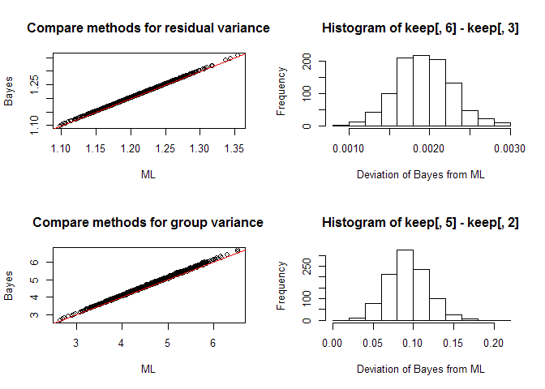
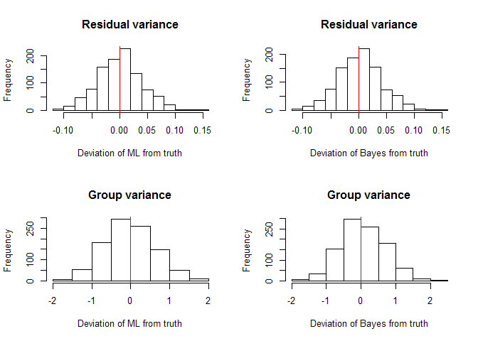

Simulating a multilevel model
================
Brett Melbourne
11 Nov 2018 (updated 8 Mar 2020)

Simulating a model is a great way to gain **understanding** of your
scientific problem, your experimental design, and the training (model
fitting) algorithm. It’s also a very good way to **test that you have
everything set up correctly** in your analysis. If you have everything
set up correctly, estimated parameters from the model fitted to
simulated data should be consistent with the known parameters in the
simulation. **Before** you even collect any data, it’s a great way to
**explore sampling or experimental designs** to get the strongest
inference. This is related to, and is an excellent replacement for,
power analysis, which is no longer considered to be formally valid in
most situations. **After** you’ve done an analysis, simulation can be
used to ask: **“Does the fitted model look right?”**. In other words,
does the fitted model generate data that look anything like the real
data? In `rstanarm` this is the **posterior predictive check** in the
diagnostics.

Here, I’ll demonstrate simulating the simplest multilevel model with no
predictors but the ideas extend easily to more complex models. We will
consider the model:

")  
")  

The **model algorithm** follows the hierarchical structure of the
mathematical model by first generating the among group means then
generating the data within a group conditioned on the group mean:

    Set among group mean, mubar
    Set among group variance, va
    Set data variance, vy
    For each group, j
        Draw a mean, muj, from Normal(mubar,va)
        For each data point, yi, within a group
            Draw data, yi, from Normal(muj,vy)

In practice, we will vectorize this algorithm to implement it in R.

### R code for simulating

``` r
library(lme4)
library(rstanarm)
options(mc.cores = parallel::detectCores())
```

#### Set parameters for the model

We have to decide what values to set for the model parameters. There is
a lot of flexibility here depending on what we want to do. If this is a
post analysis simulation, we’d set them to the estimated values from the
fitted model and with data structure that matched the data (number of
replicates within groups etc). If it is a pre-analysis simulation, such
as for exploring experimental designs, or testing training algorithms,
then we want to choose values that make sense, or we can vary the
parameters to examine the implications of different scenarios, such as
where most of the variance is (data vs group level), or how replicates
are distributed among groups, or which scales treatments are applied to.
Here, I’m going to try a simulation with about four times as much
variance at the group scale, a large number of groups, and ample
replication within group. My motivation is to investigate the
performance of the training algorithms under a fairly ideal situation
but we could equally explore how they perform in less than ideal
situations too. When doing simulations like this, it’s a good idea to
use parameter values that are distinctive (i.e. not integers, not equal,
not perfect ratios) to make it easier to see when things go wrong.

``` r
# Parameters for simulated data
vy <- 1.21   #Variance of y, \sigma_y^2
va <- 4.54   #Variance at group level, \sigma_{\alpha}^2
mubar <- 3.3 #Overall mean among groups, \bar{\mu}
ng <- 100    #Number of groups in data
n <- 20      #Number of data points within a group
```

#### Simulate the model

Let’s perform a single simulation and compare to a Bayesian model fit.

``` r
# Simulate group level (vectorized)
muj <- rnorm(ng,mubar,sqrt(va)) #Simulate mu_j (one per group)

# Simulate data level (vectorized)    
muj_v <- rep(muj,each=n)        #Expand groups to vector format
y <- rnorm(n*ng,muj_v,sqrt(vy)) #Simulate y depending on group means

# Compile into a dataframe
dat <- data.frame(y=y,group=factor(rep(1:ng,each=n)))
head(dat)
```

    ##          y group
    ## 1 3.916703     1
    ## 2 5.259836     1
    ## 3 5.478918     1
    ## 4 4.761073     1
    ## 5 6.483207     1
    ## 6 5.766579     1

Now fit the model to these simulated data (takes about 45 seconds):

``` r
baysfit <- stan_lmer(y ~ 1 + (1|group), data=dat, warmup=1000, iter=6000)
summary(baysfit)[c(1:6,102,103),c("mean","sd","Rhat","n_eff")] #a sample of the full output
```

    ##                                            mean         sd      Rhat n_eff
    ## (Intercept)                           3.3642940 0.21366492 1.0042384   401
    ## b[(Intercept) group:1]                1.8845927 0.32503836 1.0018137   933
    ## b[(Intercept) group:2]               -0.8650671 0.33033322 1.0016888   971
    ## b[(Intercept) group:3]                0.4640926 0.32474645 1.0018498   922
    ## b[(Intercept) group:4]                1.2965649 0.33149135 1.0013877   944
    ## b[(Intercept) group:5]               -0.5156323 0.32716558 1.0017222   927
    ## sigma                                 1.1332484 0.01841671 0.9998942 15844
    ## Sigma[group:(Intercept),(Intercept)]  4.5114568 0.67633041 1.0098083   713

``` r
cbind(intercept=mubar,sigma=sqrt(vy),Sigma_group=va) #the known parameters
```

    ##      intercept sigma Sigma_group
    ## [1,]       3.3   1.1        4.54

How has this helped us? First of all, it shows us that the training
algorithm has worked - it successfully fitted the model. Furthermore, we
see that the estimates from the fitted model (in the summary print out)
are in line with the known parameters (printed last), although not
necessarily very close to them. Also, after fitting the model a few
times, it was clear that the number of iterations needed to be boosted
from the default to ensure an adequate sample size. If we repeatedly run
the above code (generate data, fit model), we’ll get some idea of what
variation to expect between truth and estimation. We’ll also get an idea
for how reliable our algorithm is. For example, run the above enough
times and we’ll probably run into a convergence issue. We could also try
plotting the inferences and so on in a mock data analysis. This will
give us a sense of whether we have correctly set up the analysis and are
correctly estimating the quantities we want, which is highly recommended
even before we collect any lab or field data.

#### Using simulation to assess algorithms

A few simulation runs, as above, can give some sense of how an algorithm
is performing but to know whether things are working as expected we need
to look at performance over a large number of simulations. Then, an
algorithm is shown to work when the mean of the simulations (providing
an estimate for the expectation of the algorithm) closely matches the
truth. To provide an example, here I will compare the maximum likelihood
training algorithm from `lme4` to the HMC algorithm from `rstanarm`.
Beware: the following will take many hours, about 45 sec per sim due to
the Bayesian HMC. I chose 1000 replicate simulations because that would
finish in about 9 hours, running overnight on my lab server. This would
not be considered a large number for a research question. For precise
results, 5000-10000 replicates may be necessary but 1000 will be enough
for a good idea of some important properties.

``` r
# Setup
reps <- 1000 #Number of replicate simulations
keep <- matrix(NA,nrow=reps,ncol=6)

# Useful to add a timer. You could set reps to say 10 at first, then calculate
# how long it will take to run a larger simulation.
system.time(
for ( i in 1:reps ) {

#   Simulate group level
    muj <- rnorm(ng,mubar,sqrt(va)) #Simulate mu_j (one per group)
    
#   Simulate data level (vectorized)    
    muj_v <- rep(muj,each=n)        #Expand groups to vector format
    y <- rnorm(n*ng,muj_v,sqrt(vy)) #Simulate y

#   Fit model to simulated data
    dat <- data.frame(y=y,group=factor(rep(1:ng,each=n)))
    mlfit <- lmer(y ~ 1 + (1|group), data=dat, REML=FALSE)
    baysfit <- stan_lmer(y ~ 1 + (1|group), data=dat, warmup=1000, iter=6000)

#   Record results (VarCorr extracts the variance estimates)
    keep[i,] <- c(fixef(mlfit), as.data.frame(VarCorr(mlfit))[,4],
                  fixef(baysfit), as.data.frame(VarCorr(baysfit))[,4] )
    
#   Tidy up
    rm(muj,muj_v,y,dat,mlfit,baysfit)
    
#   Monitoring progress   
    if ( i %% 10 == 0 ) {
        print(i) 
    }
}
)
save(keep,file="mlvl05_sim_output.RData") #Save this 9 hour simulation!
```

Load the saved simulation output, so we can continue this script from
here any time.

``` r
load(file="mlvl05_sim_output.RData")
head(keep)
```

    ##          [,1]     [,2]     [,3]     [,4]     [,5]     [,6]
    ## [1,] 3.524219 3.715866 1.201538 3.514648 3.817298 1.203602
    ## [2,] 3.494985 5.048512 1.202593 3.474934 5.169435 1.204933
    ## [3,] 3.393923 5.799723 1.262950 3.421382 6.010955 1.264555
    ## [4,] 2.871700 4.533995 1.191438 2.862166 4.631171 1.194075
    ## [5,] 3.241595 4.418603 1.188841 3.247480 4.500282 1.190906
    ## [6,] 3.457530 4.126480 1.240760 3.449115 4.244744 1.242607

Now we can compare the “truth” (the known parameter values) to the mean
of simulated data fits (i.e. the expected value of the algorithm):

``` r
# Expected values of the algorithm
ml_mubar <- mean(keep[,1])
ml_va <- mean(keep[,2])
ml_vy <- mean(keep[,3])
b_mubar <- mean(keep[,4])
b_va <- mean(keep[,5])
b_vy <- mean(keep[,6])
```

``` r
# Compare to the truth (known parameter values)
cbind(mubar,ml_mubar,b_mubar)
```

    ##      mubar ml_mubar  b_mubar
    ## [1,]   3.3 3.283853 3.283983

``` r
cbind(vy,ml_vy,b_vy)
```

    ##        vy    ml_vy     b_vy
    ## [1,] 1.21 1.210886 1.212817

``` r
cbind(va,ml_va,b_va)
```

    ##        va    ml_va     b_va
    ## [1,] 4.54 4.508736 4.601576

The expected values (second and third values in each row above) for both
training algorithms compare favorably to the truth (first value in each
row above), especially for
 (`mubar`) and
 (`vy`). For
 (`va`), the expected value for the maximum
likelihood estimate is a little lower than the truth while the expected
value for the Bayesian estimate is a little higher. The maximum
likelihood estimate is well known to be biased downward.
<!-- we have taken the mean of the posterior distribution as a point estimate for va -->

We can compare the methods to each other:

``` r
par(mfrow=c(2,2))

# Compare methods for residual variance
plot(keep[,3],keep[,6],xlab="ML",ylab="Bayes",
     main="Compare methods for residual variance")
abline(a=0,b=1,col="red")
hist(keep[,6]-keep[,3], xlab="Deviation of Bayes from ML")

# Compare methods for group variance
plot(keep[,2],keep[,5],xlab="ML",ylab="Bayes",
     main="Compare methods for group variance")
abline(a=0,b=1,col="red")
hist(keep[,5]-keep[,2],xlab="Deviation of Bayes from ML")
```

<!-- -->

So we see that, when fitted to the same data, the Bayesian algorithm
gives (negligibly) higher estimates for the residual variance and
slightly higher (2%) estimates for the group variance. The red line is
the one to one.

We can graphically compare the algorithms to the truth:

``` r
par(mfrow=c(2,2))

# Compare to truth for residual variance
hist(keep[,3]-vy,xlab="Deviation of ML from truth",
     main="Residual variance")
abline(v=0,col="red")

hist(keep[,6]-vy,xlab="Deviation of Bayes from truth",
     main="Residual variance")
abline(v=0,col="red")

# Compare to truth for group variance
hist(keep[,2]-va,xlab="Deviation of ML from truth",
     main="Group variance")
abline(v=0,col="red")

hist(keep[,5]-va,xlab="Deviation of Bayes from truth",
     main="Group variance")
abline(v=0,col="red")
```

<!-- -->

The graphical summaries give us a lot of confidence in the algorithm.
The distributions of the errors seem very well behaved, no weirdness or
problematic outliers. We see that the two algorithms are very similar in
terms of bias and precision. It is clear that the residual variance is
much more precisely estimated than the group variance. We can quantify
these errors in a scalar summary:

``` r
# Calculate the bias and the mean squared error
ml_bias_vy <- mean( keep[,3] - vy )
ml_mse_vy <- sd( keep[,3] - vy )
b_bias_vy <- mean( keep[,6] - vy )
b_mse_vy <- sd( keep[,6] - vy )
ml_bias_va <- mean( keep[,2] - va )
ml_mse_va <- sd( keep[,2] - va )
b_bias_va <- mean( keep[,5] - va )
b_mse_va <- sd( keep[,5] - va )
```

``` r
cbind(ml_bias_vy,b_bias_vy,ml_mse_vy,b_mse_vy)
```

    ##        ml_bias_vy   b_bias_vy  ml_mse_vy  b_mse_vy
    ## [1,] 0.0008856035 0.002817486 0.03918467 0.0392259

``` r
cbind(ml_bias_va,b_bias_va,ml_mse_va,b_mse_va)
```

    ##       ml_bias_va b_bias_va ml_mse_va  b_mse_va
    ## [1,] -0.03126385 0.0615756 0.6334793 0.6401339

This confirms the tendency for the MLE to be slightly biased downward
(underestimated) for the group variance. The Bayesian estimate appears
to be slightly biased upward (overestimated). Otherwise the error
properties of the two algorithms are very similar. Of note, the mean
square error of the group variance is an order of magnitude higher than
for the residual variance.

#### Summary

We have looked at how to simulate a multilevel model. The model
algorithm is straightforward. Simulation allows us to check that
everything is working or to conduct detailed investigations of training
or inference algorithms.
